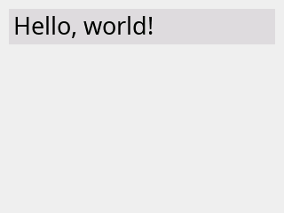
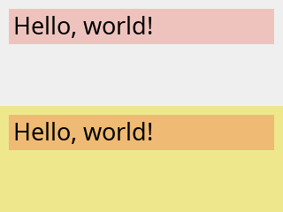
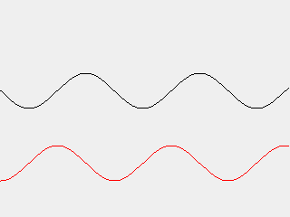
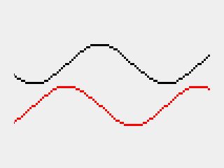

# roo_display

This is work in progress. Please come back soon for updated content!

## Fundamentals

### Connecting your display

This step is necessary if your display and your microcontroller are separate devices. In this case, you need to connect them together.

SPI displays are common. For these, you need to connect at least 4 signals: SPI SCK, SPI MOSI, display CS (chip select), and display DC (data/command). With touch displays, you will need to connect at least two additional signals, say SPI MISO and touch CS in case of a SPI-based touch device. Additionally, you may need to connect a BL signal (backlit, used to control brightness), and a RST signal (hardware reset of the display). BL may usually be connected directly to VCC if you don't plan to adjust brightness programmatically.

For modern microcontrollers such as ESP32, you can use pretty much any digital I/O pins to connect these signals. If you can, use default SPI pins; it will make configuration a bit simpler.

### Basic setup

The minimalistic GUI application consists of the following basic steps:

* Instantiate a display driver for your hardware
* Instantiate the main display object
* Initialize the transport (e.g. SPI)
* Initialize the display: set parameters such like screen orientation, background color; clear the screen.

For example, a basic app that uses an ILI 9341 SPI display may look like this:

```cpp
#include "Arduino.h"

#include "roo_display.h"
#include "roo_display/driver/ili9341.h"

using namespace roo_display;

Ili9341spi<5, 2, 4> device(Orientation().rotateLeft());
Display display(device);

void setup() {
  // Use default SPI pins, or specify your own.
  SPI.begin();

  // Set the background color, and clear the screen.
  display.init(color::White);
}

void loop() {}
```

This application configures an ILI 9341 display, using the default SPI interface with default pins (on ESP32, these are 18 for SCK, 23 for MOSI, and 19 for MISO), as well as GPIO 5 for CS, GPIO 2 for DC, and GPIO 4 for RST. The screen is left-rotated, i.e. in a 320x240 portrait mode.

We will now look at the steps in more detail.

#### Device drivers

All builtin drivers can be found in the ```roo_display/driver``` subdirectory. Look near the end of the header file to find the class name to use.

SPI drivers are generally class templates looking like this:

```cpp
template<pinCS, pinDC, pinRST>
class XXXspi { ... };
```

The template arguments allow you to specify pins that connect to your display's
CS, DC and RST signals. The driver may accept additional template parameters, e.g. overriding the default SPI settings. See the driver's comments for more details.

When you instantiate the SPI driver without any additional parameters, it will assume the default SPI interface. If you need to override that interface, you can do so by specifying one in the constructor:

```cpp
decltype(SPI) vspi(VSPI);

Ili9341spi<5, 2, 4> device(vspi);
Display display(device);

void setup() {
  vspi.begin();
}
```

#### Transport

As the examples above illustrate, you need to manually initialize the transport before doing anything else with the display. In this case, since we are using SPI, we need to explicitly call ```SPI.init()```.

By separating SPI initialization from display initialization, ```roo_display``` naturally supports complex configurations, e.g. connecting multiple displays, along with other SPI devices, to the same shared SPI bus.

#### Screen orientation

Display devices tend to support 8 different orientations. These result from a combination of 3 boolean flags: flipping along the horizontal axis, flipping along the vertical axis, and swapping the axes. Equivalently, the same 8 orientations can be considered to be a combination of 4 rotations (0, 90, 180, and 270 degrees) with a possible mirror flip along the X direction.

The ```Orientation``` class allows you to construct the desired orientation intuitively, e.g. as a combination of rotations and flips. In simple cases, a simple ```rotateLeft()```, ```rotateRight```, or ```rotateUpsideDown()``` will suffice, but the other methods may come handy in case you need to change the orientation dynamically (e.g. flip the display or rotate it).

Internally, the orientation object is represented by just a single byte, and it should be passed by value.

#### The display object

The display object encapsulates the driver, and it is the 'root' of your future interactions with the library. Post-initialization, you use it primarily to create drawing contexts, as described below. You may also use it to change the display orientation, and global settings such as the main clipping rectangle, a global background, or touch calibration settings. It is also used for retrieving touch input. These features will be described in later sections.

### DrawingContext and drawables

To draw an object, it must implement the ```Drawable``` interface:

```cpp
class Drawable {
 public:

  // Returns the bounding box encompassing all pixels that need to be drawn.
  virtual Box extents() const = 0;

  // Returns the boundaries to be used when aligning this drawable.
  virtual Box anchorExtents() const { return extents(); }

 private:
  virtual void drawTo(const Surface &s) const;
};
```

Later, you will see how to implement your own drawables. We will then dive into the Drawable interface (particularly, the ```drawTo()``` method) in more detail. For now, we will draw common, existing drawables. The point to take home, though, is the set of drawable primitives is open-ended. You are not restricted to a set of predefined primitives. You can roll your own drawables that will be rendered as efficiently as the built-ins, and they will work seamlessly with all the features of the library (clipping, transformations, fliters, etc.)

So, how do we actually draw a drawable?

To do so, we need to do one more step, which is to create a drawing context:

```cpp
DrawingContext dc(display);
dc.draw(drawable);
```

Drawing contexts further 'virtualize' the display, and allow tweaks that we will soon dive into. Drawing contexts keep SPI transactions alive, so they should be transient, i.e. destroyed quickly after you are done with the drawing.

### Drawing basic geometry

Let us put all of this together do draw some basic shapes:

```cpp
#include "Arduino.h"

#include "roo_display.h"
#include "roo_display/driver/ili9341.h"
#include "roo_display/shape/basic_shapes.h"

using namespace roo_display;

Ili9341spi<5, 2, 4> device(Orientation().rotateLeft());
Display display(device);

void setup() {
  SPI.begin();
  display.init(Graylevel(0xF0));
}

void loop() {
  DrawingContext dc(display);
  // Top-left corner at (20,20) and a diameter of 160.
  dc.draw(FilledCircle::ByExtents(20, 20, 160, color::Red));
  // Filled rectangle with corners at (10,15) and (80,120).
  dc.draw(FilledRect(10, 15, 80, 120, color::Orange));
  // Line from (10,10) to (120,80).
  dc.draw(Line(10, 10, 120, 80, color::Blue));

  delay(10000);
}
```


### Color

The `roo_display` library internally uses 32-bit ARGB color. Most SPI displays use RGB565, with 16 bits per pixel. The conversion from the 32-bit ARGB to the device color is performed in the driver - that is, if your driver is capable of handling 24- or 32-bit color, you will get it without any loss of quality, but in most cases, your driver will downgrade to RGB565.

The 'A' in ARGB stands for 'alpha', which means 'translucency'. The `roo_display` library supports translucent color modes with alpha-blending. Most displays do not support transparency directly, so we will explore these color modes more in the section on offscreen drawing and overlays.

The color is represented by the ```Color``` class. It simply encapsulates the uint32_t integer, but provides convenience methods to simplify common operations.

You can specify regular, opaque RGB colors by calling the 3-argument constructor:

```cpp
Color c(0xF0, 0xC0, 0xC0);
```

You can also set each channel individually:

```cpp
c.set_r(0x30);
c.set_a(0x43);
```

You can also set a color directly from the uint32_t ARGB representation:

```cpp
c = Color(0xF0F0F0F0);
```

Additionally, the library defines 140 named [HTML color constants](https://www.w3schools.com/colors/colors_groups.asp):

```cpp
c = color::LightGoldenRodYellow;
```

as well as a convenience function to specify a shade of gray:

```cpp
c = Graylevel(0x40);  // Dark gray.
```

### Drawing simple text

To draw text, you need to pick a font, and use a ```TextLabel```:

```cpp
#include "roo_display/ui/text_label.h"
#include "roo_smooth_fonts/NotoSans_Regular/27.h"

/// ...

void loop() {
  DrawingContext dc(display);
  dc.draw(
    TextLabel(
        "Hello, World! μΩ ₿ ķ",
        font_NotoSans_Regular_27(),
        Color(0xFF404080)), 
    5, 30);
}
```

The 'origin' of the text label is at the baseline and to the left of the text. We need to shift it a little (applying the 5,30 offset) so that it fits on the screen with some margins.


### Backgrounds and overwriting

By default, `roo_display` draws the minimum possible number of pixels:

```cpp
/// ...

void loop() {
  DrawingContext dc(display);
  dc.draw(
    TextLabel("12:00", font_NotoSans_Regular_27(), color::Blue),
    5, 30);
  dc.draw(
    TextLabel("21:41", font_NotoSans_Regular_27(), color::Red),
    5, 30);

  delay(10000);
}
```


Often, you need to overwrite previous content. In order to do so without flicker (which would have occured if you simply cleared the background), you can tell the drawing context to fill the entire extents rectangle, returned by `object.extents()`, when drawing an `object`. You can do so by setting `fill mode` to `FILL_MODE_RECTANGLE` (replacing the default, `FILL_MODE_VISIBLE`):

```cpp
/// ...

void loop() {
  DrawingContext dc(display);
  dc.setFillMode(FILL_MODE_RECTANGLE);
  dc.draw(
    TextLabel("12:00", font_NotoSans_Regular_27(), color::Blue),
    5, 30);
  dc.draw(
    TextLabel("21:41", font_NotoSans_Regular_27(), color::Red),
    5, 30);

  delay(10000);
}
```


So far, we have been using the default background color, which we had set in the call to `device.init()`. That default background may be overriden in the drawing context:

```cpp
void loop() {
  DrawingContext dc(display);
  dc.setBackgroundColor(color::Pink);
  dc.setFillMode(FILL_MODE_RECTANGLE);
  dc.draw(
    TextLabel(
        "Hello, World!",
        font_NotoSans_Regular_27(),
        color::Black),
    15, 35);
  dc.setFillMode(FILL_MODE_VISIBLE);
  dc.draw(
    TextLabel(
        "Hello, World!",
        font_NotoSans_Regular_27(),
        color::Black),
    15, 75);
}
```


Note that since the font is anti-aliased, setting the correct background color matters even with `FILL_MODE_VISIBLE`. Using background that does not match the underlying background results in 'colored' text edges, as seen in the example above.

### Alignment

The library allows drawing with specified horizontal and vertical alignment, so that you don't need to calculate and specify exact pixel offsets, ad we have been doing so far. Let's look at a simple example:

```cpp
void loop() {
  auto circle = FilledCircle::ByExtents(0, 0, 40, color::DarkGray);
  DrawingContext dc(display);
  dc.draw(circle, kLeft | kTop);
  dc.draw(circle, kCenter | kTop);
  dc.draw(circle, kRight | kTop);
  dc.draw(circle, kLeft | kMiddle);
  dc.draw(circle, kCenter | kMiddle);
  dc.draw(circle, kRight | kMiddle);
  dc.draw(circle, kLeft | kBottom);
  dc.draw(circle, kCenter | kBottom);
  dc.draw(circle, kRight | kBottom);
}
```


You can adjust the alignment using specific offsets:

```cpp
void loop() {
  auto circle = FilledCircle::ByExtents(0, 0, 40, color::DarkGray);
  DrawingContext dc(display);
  dc.draw(circle, kLeft.shiftBy(10) | kTop.shiftBy(10));
  dc.draw(circle, kCenter | kTop.shiftBy(10));
  dc.draw(circle, kRight.shiftBy(-10) | kTop.shiftBy(10));
  dc.draw(circle, kLeft.shiftBy(10) | kMiddle);
  dc.draw(circle, kCenter | kMiddle);
  dc.draw(circle, kRight.shiftBy(-10) | kMiddle);
  dc.draw(circle, kLeft.shiftBy(10) | kBottom.shiftBy(-10));
  dc.draw(circle, kCenter | kBottom.shiftBy(-10));
  dc.draw(circle, kRight.shiftBy(-10) | kBottom.shiftBy(-10));
}
```


What if you want to draw on the portion of the screen, and use that portion for alignment, rathen than the display boundaries? Not a problem - you can specify the desired bounds when creating the drawing context. The following example draws 4 shapes centered in 4 areas the screen is split into:

```cpp
void loop() {
  int w = display.width();
  int h = display.height();
  auto centered = kMiddle | kCenter;
  {
    DrawingContext dc(display, Box(0, 0, w / 2 - 1, h / 2 - 1));
    dc.draw(
      FilledCircle::ByExtents(0, 0, 40, color::Purple),
      centered);
  }
  {
    DrawingContext dc(display, Box(w / 2, 0, w - 1, h / 2 - 1));
    dc.draw(
      FilledTriangle(0, 0, 10, 50, 80, 5, color::Crimson),
      centered);
  }
  {
    DrawingContext dc(display, Box(0, h / 2, w / 2 - 1, h - 1));
    dc.draw(
      FilledRoundRect(0, 0, 70, 30, 10, color::ForestGreen),
      centered);
  }
  {
    DrawingContext dc2(display, Box(w / 2, h / 2, w - 1, h - 1));
    dc2.draw(
      FilledRect(0, 0, 40, 80, color::DodgerBlue),
      centered);
  }
}
```


For the purpose of alignment, drawables may declare 'anchor extents' that are different than the regular extents defining the bounding rectangle of their content. We will see the examples of that later.

As we saw in the examples, `kLeft` aligns left anchor of the object to the left side of the screen, `kCenter` aligns the center of the object to the center of the screen, and so on. You can override the 'destination' anchor for more specialized alignments. The following example draws the same text twice, first aligning the _top_ of the text to the middle of the sceen, and then aligning the _bottom_ of the text to the middle of the screen:

```cpp
#include "roo_smooth_fonts/NotoSerif_Italic/60.h"

// ...

void loop() {
  const auto& font = font_NotoSerif_Italic_60();
  DrawingContext dc(display);
  auto label = TextLabel("Hello!", font, color::Black);
  dc.draw(label, kCenter | kTop.toMiddle());
  dc.draw(label, kCenter | kBottom.toMiddle());

  delay(10000);
}
```


Twere are two other alignment options, `kOrigin` and `kBaseline`. They correspond to the zero coordinate in the X and Y directions, respectively. If you use them without modifiers, the object will remain unaligned along the specific axis. For example:

```cpp
dc.draw(object, kOrigin | kBaseline);
```

is equivalent to

```cpp
dc.draw(object);
```

Using these options with `to` modifiers allows you to specify where to align the zero coordinate to. It is particularly useful for aligning text at baseline, as we will see in the later section.

Given the alignment, you can calculate the absolute offset that it will apply to a given object, and use it do draw other content:

```cpp
void loop() {
  Alignment a = kCenter | kMiddle;
  TextLabel label("Hello!", font_NotoSerif_Italic_60(), color::Black);
  DrawingContext dc(display);
  Offset offset = a.resolveOffset(dc.bounds(), label.anchorExtents());
  // Equivalent to dc.draw(label, a).
  dc.draw(label, offset.dx, offset.dy);
  // Draw rect border around the text, adding 5px padding.
  Box box = label.extents().translate(offset.dx, offset.dy);

  dc.draw(Rect(box.xMin() - 5, box.yMin() - 5, box.xMax() + 5,
               box.yMax() + 5, color::Red));

}
```


### Tiles

Often, you need to draw variable-sized contents over some preallocated space. A simple example is to overwrite some previously drawn text with new text that might possibly be shorter. In this case, even if you set `FILL_MODE_RECTANGLE`, the original contents will not be completely erased, since the new contents has smaller extents.

You can solve this problem using the `Tile` utility class. A tile is a rectangular 'container' of a predefined size, which you can think of as padding of a specified background color around your drawable. The position of your drawable within the tile is given by an alignment.

Tiles redraw their contents without flicker, as long as the contents itself draws without flicker, which is true for `TextLabel` and most other builtin drawables.

Tile takes a pointer to the interior drawable when constructed:

```cpp
#include "roo_smooth_fonts/NotoSans_Regular/27.h"

// ...
void loop() {
  const auto& font = font_NotoSans_Regular_27();
  TextLabel label1("Hello, hello, world!", font, color::Black);
  TextLabel label2("Hello, world!", font, color::Black);
  Box extents(10, 10, 309, 49);
  Alignment a = kLeft.shiftBy(5) | kMiddle;
  DrawingContext dc(display);
  Tile tile1(&label1, extents, a, color::Gainsboro);
  dc.draw(tile1);
  delay(2000);
  Tile tile2(&label2, extents, a, color::Gainsboro);
  dc.draw(tile2);
  delay(2000);
}
```

You can inline some of the objects as temporaries by using `MakeTileOf`:

```cpp
void loop() {
  const auto& font = font_NotoSans_Regular_27();
  Box extents(10, 10, 309, 49);
  Alignment a = kLeft.shiftBy(5) | kMiddle;
  DrawingContext dc(display);
  dc.draw(MakeTileOf(
      TextLabel("Hello, hello, world!", font, color::Black),
      extents, a, color::Gainsboro));
  delay(2000);
  dc.draw(MakeTileOf(
      TextLabel("Hello, world!", font, color::Black),
      extents, a, color::Gainsboro));
  delay(2000);
}
```



You can omit the tile's background color. It will then default to `color::Background`, inheriting the drawing context's background, but still forcing `FILL_MODE_RECTANGLE`. That is, such a tile will draw its entire extents, regardless of the fill mode settings. It is most likely the the most commonly needed behavior: the background is 'invisible' yet the contents get redrawn when needed without extra hassle.

If you need to, however, you can force the tile to respect the fill mode settings, by explicitly specifying `color::Transparent` as the background.

You can also specify a translucent background color. In this case, the actual background will be the alpha-blend of the tile's background over the drawing context's background:

```cpp
void setup() {
  // ...
  int w = display.width();
  int h = display.height();
  DrawingContext dc(display);
  dc.draw(FilledRect(0, h / 2, w - 1, h - 1, color::Khaki));
}

void loop() {
  auto tile = MakeTileOf(
      TextLabel(
          "Hello, world!",
          font_NotoSans_Regular_27(),
          color::Black),
      Box(10, 10, 309, 49),
      kLeft.shiftBy(5) | kMiddle,
      color::Red.withA(0x30));
  DrawingContext dc(display);
  dc.draw(tile);
  dc.setBackgroundColor(color::Khaki);
  dc.draw(tile, 0, display.height() / 2);
  delay(10000);
}
```



### Clipping

You can set a _clip box_ on a drawing context in order to constrain the drawn area to a specific rectangle.

```cpp
void loop() {
  const auto& font = font_NotoSerif_Italic_60();
  auto label = TextLabel("Hello!", font, color::Black);
  int w = display.width();
  int h = display.height();
  DrawingContext dc(display);
  dc.setClipBox(0, 0, w - 1, 179);
  dc.draw(FilledCircle::ByRadius(w / 2, 179, w / 2 - 20, color::Gold));
  dc.setBackgroundColor(color::Gold);
  dc.setClipBox(0, 0, w - 1, h / 2 - 1);
  label.setColor(color::Maroon);
  dc.draw(label, kCenter | kMiddle);
  dc.setClipBox(0, h / 2, w - 1, h - 1);
  label.setColor(color::MidnightBlue);
  dc.draw(label, kCenter | kMiddle);

  delay(10000);
}
```


You can also set a _clip mask_, which is a bit mask allowing to define arbitrary clipping shapes.

```cpp
#include "Arduino.h"

#include "roo_display.h"
#include "roo_display/driver/ili9341.h"
#include "roo_display/shape/basic_shapes.h"

#include "roo_display/ui/text_label.h"
#include "roo_smooth_fonts/NotoSerif_Italic/60.h"

using namespace roo_display;

Ili9341spi<5, 2, 4> device(Orientation().rotateLeft());
Display display(device);

// 320x60 pixels.
uint8_t mask_data[320 * 60 / 8];

void setup() {
  SPI.begin();
  display.init(Graylevel(0xF0));
  for (int i = 0; i < 30; i++) {
    // Alternate rows: bits set, bits cleared.
    memset(mask_data + 2 * i * 320 / 8, 0xFF, 320 / 8);
    memset(mask_data + (2 * i + 1) * 320 / 8, 0x00, 320 / 8);
  }
}

void loop() {
  const auto& font = font_NotoSerif_Italic_60();
  auto label = TextLabel("Hello!", font, color::Black);
  int w = display.width();
  int h = display.height();
  DrawingContext dc(display);
  dc.setClipBox(0, 0, w - 1, 179);
  dc.draw(FilledCircle::ByRadius(w / 2, 179, w / 2 - 20, color::Gold));
  dc.setBackgroundColor(color::Gold);
  ClipMask mask1(mask_data, Box(0, 90, 319, 149));
  dc.setClipMask(&mask1);
  label.setColor(color::DarkSalmon);
  dc.draw(label, kCenter | kMiddle);
  // Same as before, but shifted by one row.
  ClipMask mask2(mask_data, Box(0, 91, 319, 150));
  dc.setClipMask(&mask2);
  label.setColor(color::MidnightBlue);
  dc.draw(label, kCenter | kMiddle);
  dc.setClipMask(nullptr);  // To be on the safe side.

  delay(10000);
}
```


You will see an easier way to initialize a clip mask in the section on offscreen drawing.

> Note: drawing with a clip mask is noticeably slower. Use wisely.

### Transformations

You can apply basic affine transformations (integer scaling, right-angle rotation, translation) to anything you draw.

A transformation is represented by the `Transformation` object. Calling its default constructor creates an 'identity' transformation, i.e. one that does not change anything. You can then use it as a starting point to compose your transformation, by calling methods that add specific modifications, such as: translation, scaling, rotation, coordinate swapping, and others. You can also use a more specialized constructor to initialize your transformation in one step.

Likely the most important application of transformations is rotated or scaled text:

```cpp
#include "roo_display/filter/transformation.h"

// ...

void loop() {
  DrawingContext dc(display);
  dc.setTransformation(Transformation().scale(10, 3));
  dc.draw(
      TextLabel("F", font_NotoSerif_Italic_27(), color::Black),
      kCenter | kMiddle);
  dc.setTransformation(Transformation().rotateLeft());
  dc.draw(
      TextLabel("Hello, World!", font_NotoSerif_Italic_27(), color::Black),
      kLeft | kMiddle);
  dc.setTransformation(Transformation().rotateRight().flipX());
  dc.draw(
      TextLabel("Hello, World!", font_NotoSerif_Italic_27(), color::Black),
      kRight | kMiddle);
  delay(10000);
}
```


### Drawing individual pixels

There is no 'Pixel' drawable. Drawing pixels as individual drawables would be slow.

Instead, you can draw pixels in batches, using the following idiom:

```cpp
void loop() {
  DrawingContext dc(display);
  dc.drawPixels([](PixelWriter& writer) {
    for (int i = 0; i < 319; ++i) {
      writer.writePixel(i, 100 + (int)(20 * sin(i / 20.0)), color::Black);
    }
    for (int i = 0; i < 319; ++i) {
      writer.writePixel(i, 180 + (int)(20 * cos(i / 20.0)), color::Red);
    }
  });
  delay(10000);
}
```



Pixel drawing respects settings of the drawing context, such as the clip region, and transformation:

```cpp
void loop() {
  DrawingContext dc(display);
  dc.setClipBox(20, 20, 299, 219);
  dc.setTransformation(Transformation().scale(3, 3));
  dc.drawPixels([](PixelWriter& writer) {
    for (int i = 0; i < 100; ++i) {
      writer.writePixel(i, 30 + (int)(10 * sin(i / 10.0)), color::Black);
    }
    for (int i = 0; i < 100; ++i) {
      writer.writePixel(i, 50 + (int)(10 * cos(i / 10.0)), color::Red);
    }
  });
  delay(10000);
}
```



> Note: `PixelWriter` buffers the pixels and flushes them in batches, in order to optimize the underlying write operations. Therefore, the pixels may not appear until `drawPixels()` returns.

When possible, try to draw subsequent pixels in horizontal or vertical streaks, i.e., write pixels in a single direction as much as possible. It may help the underlying device driver to reduce communication volume (e.g. SPI transfers), thus improving performance.

## Working with text

This section digs deeper into the details of handling text output.

### Fonts

As most things in `roo_display`, a font is represented by an abstract class: `Font`. Most of the time, you can treat a font as an opaque object that you pass to `TextLabel`. Nonetheless, we will now look at `Font` in some more detail.

Logically, each font is a collection of _glyphs_ (individual symbols), covering some subset of Unicode.

#### Pre-packaged fonts

The primary concrete font implementation in `roo_display` is the `SmoothFont` class. A smooth font stores glyphs in PROGMEM, using a custom internal data format. Smooth fonts are anti-aliased (they use 4-bit alpha), and support kerning. In order to use a smooth font, all you need to do is to include and reference it, as we saw in the examples above.

Most smooth fonts are _proportional_ (e.g. have varying glyph width), but they can also be _monotype_ (fixed width).

Only the fonts that you actually reference get linked into your program. Don't worry when you see font files compiling - if you don't use them, your program's binary will not carry them.

The `roo_display` library comes with a collection of free Noto fonts in various sizes and faces. They include Sans, Sans condensed, Mono, and Serif, and they come with bold and italic variants. The default charset includes about 340 glyphs, covering basic Latin, Latin-1 supplement, Latin Extended-A, as well as some assorted symbols (currency symbols, some commonly used Greek letters, etc.) You can quite easily see what specific glyphs are supported simply by looking at the font's `cpp` file.

The footprint of smooth fonts in PROGMEM is reasonably small - unless you use many large fonts, they should not bloat your binaries. For example, the Noto Sans regular 27, which we have used a lot in the examples, uses 34KB (about 100 bytes per glyph on average). Large, complex fonts need more space: for example, Noto Serif italic 90 uses 177 KB total (about 520 bytes per glyph on average).

> Note: storing fonts in PROGMEM allows `roo_display` to access and render them much more efficiently than if they were stored e.g. on an external SD card.

In addition to smooth fonts, you will also find a simple fixed-size 5x7 'Adafruit' ASCII font. You will likely not find it very useful, except perhaps as a simple case study of the font implementation.

#### Importing custom fonts

There are many reasons why you might want to import additional fonts. Maybe you want to use a different face; maybe you need a different size, or maybe you need a different set of glyphs. Whatever the reason, importing fonts is easy, with help of [roo_display_font_importer](https://github.com/dejwk/roo_display_font_importer). This Java-based tool will convert any font available in your system, at any size you want, and with any glyph subset you want, to a smooth font that you can use with `roo_display`.

As an example, let's import all available glyphs from the OpenSymbol font:

```
wget https://github.com/dejwk/roo_display_font_importer/releases/download/1.0/roo_display_font_importer.zip
unzip roo_display_font_importer.zip
./roo_display_font_importer/bin/roo_display_font_importer -font OpenSymbol -sizes 40 -charset 0-FFFF
```

The resulting font has 162KB and over 1000 glyphs. Let's look at some of them:

```cpp
#include "OpenSymbol/40.h"

// ...

void loop() {
  const Font& font = font_OpenSymbol_40();
  DrawingContext dc(display);
  dc.draw(TextLabel("▲△▴▵▶▷▸▹►▻", font, color::Black), 0, 40);
  dc.draw(TextLabel("▼▽▾▿◀◁◂◃◄◅", font, color::Black), 0, 80);
  dc.draw(TextLabel("◊○●◗◦☎☑☒☛☞", font, color::Black), 0, 120);
  dc.draw(TextLabel("☹☺☼♠♣♥♦✂✈✍✎✓✔", font, color::Black), 0, 160);
  dc.draw(TextLabel("✗✘✙✚✛✜✢✣✤✥✫✬✭✮✯", font, color::Black), 0, 200);
  dc.draw(TextLabel("✰✳✴✵✶✷✸✹✿❁❄❍❏❐❑❒", font, color::Black), 0, 240);
  delay(10000);
}
```


#### Metrics

You can obtain general font metrics by calling `font.metrics()`. The returned `FontMetrics` object allows you to obtain FreeType properties of the font, such as ascent, descent, linegap, linespace, as well as the maximum glyph extents. You can also find out the minimum left- and right-side bearing, which specify how much can a glyph 'stick out' of its anchor extents. More on that below, in the section on alignment.

Generally, using font metrics can help write your application so that it can work with different font sizes.

You can also call `font.properties()` to find out basic facts about the font, such as whether it is proportional or monospace, whether it is antialiased, and whether it uses kerning.

Finally, by calling `font.getHorizontalStringGlyphMetrics(StringView)` you can measure the properties of glyphs or entire strings, without drawing them. Specifically, you can obtain a `GlyphMetrics` object, which reveals the string's bounding box, as well as the advance width, which is essentially the width for the purpose of alignment.

That said, the same properties are also captured by `TextLabel`'s `extents()` and `anchorExtents()`, which may be simpler to use (see below).

### Alignment

Text alignment can be a little tricky. When optically left- or right-aligned, a glyph, such as 'y', may actually have a 'tail' that hang outside of the alignment boundary. Another glyph, such as 'i', may have a gap. Top and bottom alignment does not depend on glyphs at all, but only on the overall font's metrics, so that the text doesn't jump up and down when the content changes. Also, in many cases, you may need to keep text aligned at baseline.

Luckily, all these subtleties are captured by the `TextLabel`'s `anchorExtents()`. Let's see what they may look like for some sample text:

```cpp
#include "roo_smooth_fonts/NotoSerif_Italic/90.h"

// ...

void loop() {
  const auto& font = font_NotoSerif_Italic_90();
  int dx = 40;
  int dy = 160;
  DrawingContext dc(display);
  auto label = TextLabel("yeah.", font, color::Black);
  dc.setBackgroundColor(color::LightGray);
  dc.draw(FilledRect(label.extents(), color::LightGray), dx, dy);
  dc.draw(Line(dx, 0, dx, display.height() - 1, color::Red));
  dc.draw(Line(0, dy, display.width() - 1, dy, color::Red));
  dc.draw(Rect(label.anchorExtents(), color::Blue), dx, dy);

  dc.draw(label, dx, dy);

  delay(10000);
}
```


Here, the gray box is a minimum bounding rectangle, and the blue frame corresponds to the anchor extents. Red crosshairs indicate the axes, i.e. the cross is at (0, 0).

(These bounding values of the `TextLabel` are derived from the font and glyph metrics: the width of the blue frame is the advance, the 'overhang' of the letter 'y' is equal to the left-side bearing, and so on).

When you draw aligned text using the built-in mechanisms, the library will do the right thing. You only need to keep in mind that some left or right padding may be needed (for left-aligned and right-aligned text, respectively) to leave room for overhangs, as they may otherwise get truncated:

```cpp
#include "roo_smooth_fonts/NotoSerif_Italic/27.h"

// ...

void loop() {
  const auto& font = font_NotoSerif_Italic_27();
  auto label = TextLabel("yeah.", font, color::Black);
  int dx = 10;
  int dy = 10;
  int w = display.width();
  int h = display.height();
  DrawingContext dc(display);
  dc.draw(Line(0, dy, w - 1, dy, color::Red));
  dc.draw(Line(0, h - dy - 1, w - 1, h - dy - 1, color::Red));
  dc.draw(Line(dx, 0, dx, h - 1, color::Red));
  dc.draw(Line(w - dx - 1, 0, w - dx - 1, h - 1, color::Red));
  dc.draw(label, kLeft.shiftBy(dx) | kTop.shiftBy(dy));
  dc.draw(label, kCenter | kTop.shiftBy(dy));
  dc.draw(label, kRight.shiftBy(-dx) | kTop.shiftBy(dy));
  dc.draw(label, kLeft.shiftBy(dx) | kMiddle);
  dc.draw(label, kCenter | kMiddle);
  dc.draw(label, kRight.shiftBy(-dx) | kMiddle);
  dc.draw(label, kLeft.shiftBy(dx) | kBottom.shiftBy(-dy));
  dc.draw(label, kCenter | kBottom.shiftBy(-dy));
  dc.draw(label, kRight.shiftBy(-dx) | kBottom.shiftBy(-dy));

  delay(10000);
}
```


If you want to know exactly how much padding is needed for a given font so that it never truncates any glyph, use `font.metrics().minLsb()` and `font.metrics().minRsb()`. Note that 'overhangs' are represented by negative values. That is, if these methods return non-negative values, the text will never overhang for that font.

#### Aligning at baseline

Text baseline always has y-coordinate zero. Therefore, using `kBaseline` will keep the text aligned at baseline:

```cpp
#include "roo_smooth_fonts/NotoSerif_Italic/10.h"
#include "roo_smooth_fonts/NotoSerif_Italic/15.h"
#include "roo_smooth_fonts/NotoSerif_Italic/18.h"
#include "roo_smooth_fonts/NotoSerif_Italic/27.h"
#include "roo_smooth_fonts/NotoSerif_Italic/40.h"

// ...

void loop() {
  int dx = 5;
  auto label1 = TextLabel(
    "Hello ", font_NotoSerif_Italic_10(), color::Black);
  auto label2 = TextLabel(
    "Hello ", font_NotoSerif_Italic_15(), color::Black);
  auto label3 = TextLabel(
    "Hello ", font_NotoSerif_Italic_18(), color::Black);
  auto label4 = TextLabel(
    "Hello ", font_NotoSerif_Italic_27(), color::Black);
  auto label5 = TextLabel(
    "Hello ", font_NotoSerif_Italic_40(), color::Black);
  DrawingContext dc(display);
  dc.draw(label1, kLeft.shiftBy(dx) | kBaseline.toMiddle());
  dx += label1.anchorExtents().width();
  dc.draw(label2, kLeft.shiftBy(dx) | kBaseline.toMiddle());
  dx += label2.anchorExtents().width();
  dc.draw(label3, kLeft.shiftBy(dx) | kBaseline.toMiddle());
  dx += label3.anchorExtents().width();
  dc.draw(label4, kLeft.shiftBy(dx) | kBaseline.toMiddle());
  dx += label4.anchorExtents().width();
  dc.draw(label5, kLeft.shiftBy(dx) | kBaseline.toMiddle());
  dx += label1.anchorExtents().width();

  delay(10000);
}
```


Note that for spacing the words, we relied on the fact that `anchorExtents().width()` is equal to the text advance, and that the 'space' glyph has proper advance for its font size, resulting in naturally-looking spacing.

### UTF-8

Text labels, as well as any other routines operating on strings, assume UTF-8 encoding. Most code editors also use UTF-8, which means that you can simply paste Unicode content into your string literals, and things just work (see the OpenSymbol example above).

The library provides a few utilities to work with UTF-8, in the `"roo_display/core/utf8.h"` header:

* `StringView` is a lightweight, immutable pointer to UTF-8 contents, conceptually similar to `std::u8string_view` (introduced in C++20), and used across the library.
* `EncodeRuneAsUtf8()` is a convenience function that helps converting regular, multi-byte UTF code points to UTF-8.
* `Utf8Decoder` is a utility class that does the opposite, i.e. it allows to extract subsequent code points out of UTF-8 content.

### Formatted text

The library provides convenience 'sprintf-like' utilities in `"roo_display/ui/string_printer.h"`. You can use them to format text into `std::string`, which is used in other places such as the `TextLabel`.

> Note: do not shy away from using `std::string`. It works well on microcontrollers such as ESP32. For best performance, strings should be passed by value and _moved_ (rather than copied). Classes such as `TextLabel` already provide suitable move constructors, making things 'just work'.

```cpp
TextLabel label(StringPrintf("%.1f°C", temp), font, color);
```

### Drawing numbers

Digits are often monotype, even in proportional fonts. Sometimes you can use this property to minimize redraws; e.g. use glyph metrics to determine positions of digits, and then update the individual digits.

Be careful, though: even though the _anchor_ extents of all digits may be the same, the regular extents are not. The bounding box of digit '1' is going to be smaller than that of digit '0', even though they have the same advance. For this reason, you may still need to use `Tile` when rendering numeric content.

## Drawing images and icons

The `roo_display` library supports drawing JPEG and PNG images out of the box.

For low-footprint artwork such as icons and small images, the library provides an alternative, highly efficient image format, supporting a wide range of color modes, and featuring a lightweight lossless compression. A companion `roo_display_image_importer` tool allows you to convert your image files to this internal format. In most cases, small images are icons can be embedded directly into your program. You also have an option to store them on SPIFFS or some external file system.

If you just want to use some simple icons, there is a companion library of `roo_material_icons`, containing over 34000 Google 'Material Design' icons in various styles and 4 predefined sizes.

### JPEG and PNG

You can easily draw JPEG and PNG images stored on an SD card, SPIFFS, or some other file system:

```cpp
#include "roo_display/image/jpeg/jpeg.h"
#include "SD.h"

// ...

void setup() {
  // ...
  SD.begin(sdCsPin);
}

void main() {
  JpegDecoder decoder;
  JpegFile jpg(decoder, SD, "/wallaby.jpg");
  DrawingContext dc(display);
  dc.draw(jpg, kCenter | kMiddle);
}
```

### Importing images into the native format

### Using the Material Icons collection

## Using off-screen buffers

## Overlays, backgrounds, filters

## Touch

## Flicker-less composition

## Extending the library

### Implementing custom drawables

### Adding new device drivers

### Supporting non-SPI transports

## UI utilities

### Tile
