# About the library

`roo_display` is a feature-rich, fast, and easy to use library intended for building 'smart home' and similar controllers with graphical UI and optionally touch control.

## Highlights

* Text: anti-aliasing, kerning, zero-flicker, FreeType-style alignment, font metrics, UTF-8, formatting;
* Fonts: collection of Google Noto Sans, Serif, and Mono fonts in various styles (regular, bold, condensed, italic, combinations), and multiple sizes included. Extended alphabet. Font import tool available;
* Shapes: variety of basic and anti-aliased shapes including filled and stroked circles, round-rectangles, triangles, wedges, pies, trapezoids, lines, and arcs, with specified widths and rounded or flat endings;
* Offscreen: supports drawing to memory buffers, using a rich variety of color modes (ARGB 8888, RGBA 8888, RGB 888, ARGB 6666, ARGB 4444, RGB 565, Gray8, Gray4, GrayAlpha8, Alpha8, Alpha4, Indexed8, Indexed4, Indexed2, Indexed1);
* Images: JPEG, PNG; custom RLE-encoded as well as uncompressed PROGMEM-compatible image formats, supporting variety of color modes (same as above); image import tool available;
* Icons: includes a collection of over 34000 Google Material Icons, divided into 4 styles, 18 categories, and 4 sizes;
* Positioning: flexible alignment options, magnification / stretch, rotation;
* Clipping: clip rectangles, clip masks;
* Color: internal 32-bit ARGB; transparency, alpha-blending, alpha-compositing, 140 named HTML colors; multi-node color gradients: linear, radial, angular;
* Compositing: backgrounds, overlays (sprites), zero-flicker, memory-conservative Porter-Duff and blending modes;
* Touch: excellent quality drivers with noise filtering and smoothing; supports multi-touch on compliant devices;
* Extensibility: clean abstractions, including drawable objects, device drivers, fonts; supports arbitrary extensions (e.g. user-defined drawables, third-party drivers) as first-class entities;
* Excellent performance: highly optimized SPI transport, vectorized interfaces;
* Low footprint: memory-conscious implementation;
* Documentation: comprehensive [programming guide](doc/programming_guide.md);
* See also: a companion [roo_windows](https://github.com/dejwk/roo_windows) library for building complex touch-based UI applications with scroll, animation, etc.

## Compatibility

* Supported SPI display drivers: ILI9341, ILI9486, ILI9488, SSD1327, ST7735, ST7789;
* ESP32S3 DMA parallel driver harness;
* Adapter driver for TFT_eSPI-supported displays;
* Supported touch drivers: XPT2046, FT6x36, GT911;
* Supported integrated devices (microcontroller + touch display): LilyGo T-Display-S3, Makerfabs: 3.5in, ILI9488 SPI-based capacitive touch combo; 4.3in, parallel DMA-based capacitive touch combo.

## Gallery

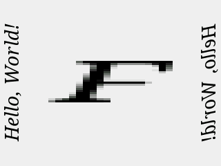
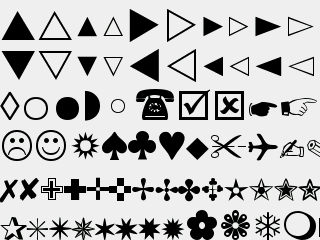
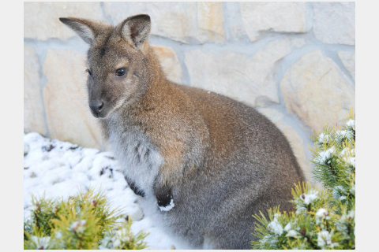
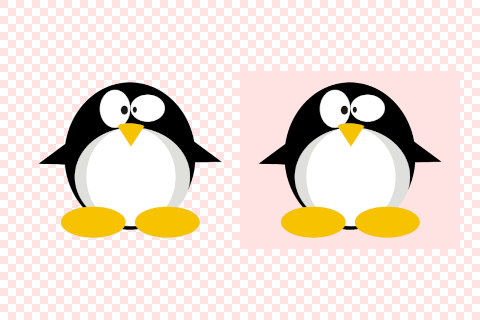
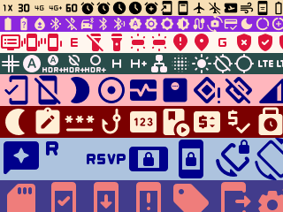
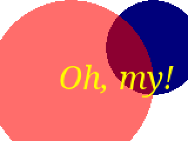
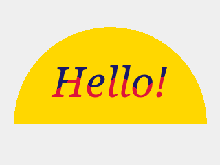
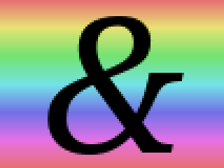
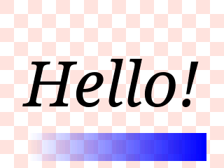
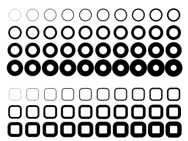
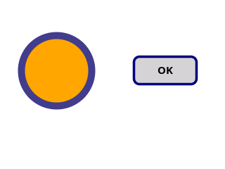
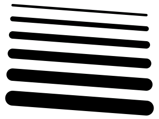
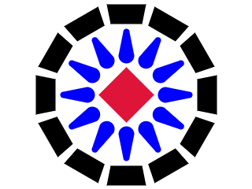
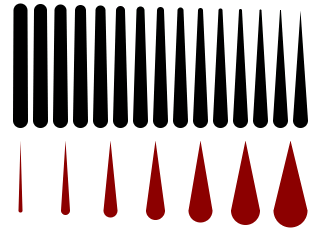
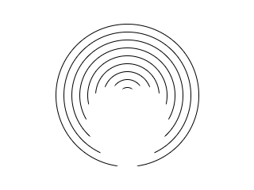
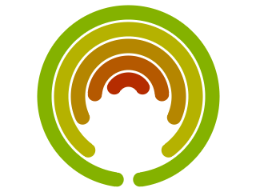
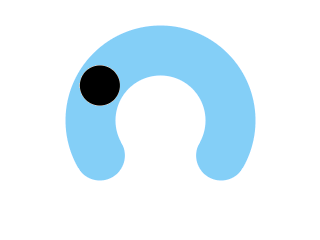
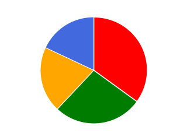
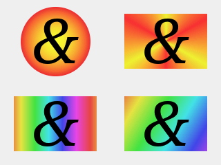

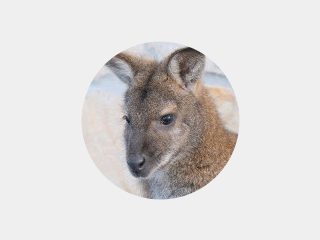
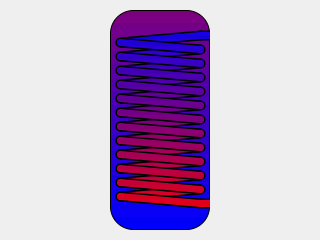
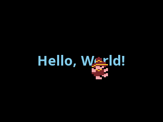
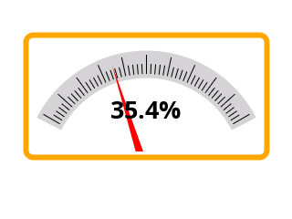

## User documentation

* [Programming guide](doc/programming_guide.md).
* [Quick start for TFT_eSPI]((doc/for_tft_espi_users.md)) users.