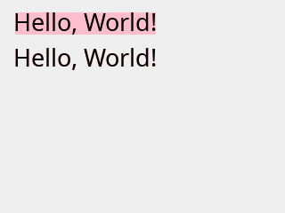

# roo_display

This is work in progress. Please come back soon for updated content!

## Fundamentals

### Connecting your display

This step is necessary if your display and your microcontroller are separate devices. In this case, you need to connect them together.

SPI displays are common. For these, you need to connect at least 4 signals: SPI SCK, SPI MOSI, display CS (chip select), and display DC (data/command). With touch displays, you will need to connect at least two additional signals, say SPI MISO and touch CS in case of a SPI-based touch device. Additionally, you may need to connect a BL signal (backlit, used to control brightness), and a RST signal (hardware reset of the display). BL may usually be connected directly to VCC if you don't plan to adjust brightness programmatically.

For modern microcontrollers such as ESP32, you can use pretty much any digital I/O pins to connect these signals. If you can, use default SPI pins; it will make configuration a bit simpler.

### Basic setup

The minimalistic GUI application consists of the following basic steps:

* Instantiate a display driver for your hardware
* Instantiate the main display object
* Initialize the transport (e.g. SPI)
* Initialize the display: set parameters such like screen orientation, background color; clear the screen.

For example, a basic app that uses an ILI 9341 SPI display may look like this:

```cpp
#include "Arduino.h"

#include "roo_display.h"
#include "roo_display/driver/ili9341.h"

using namespace roo_display;

Ili9341spi<5, 2, 4> device(Orientation().rotateLeft());
Display display(device);

void setup() {
  // Use default SPI pins, or specify your own.
  SPI.begin();

  // Set the background color, and clear the screen.
  display.init(color::White);
}

void loop() {}
```

This application configures an ILI 9341 display, using the default SPI interface with default pins (on ESP32, these are 18 for SCK, 23 for MOSI, and 19 for MISO), as well as GPIO 5 for CS, GPIO 2 for DC, and GPIO 4 for RST. The screen is left-rotated, i.e. in a 320x240 portrait mode.

We will now look at the steps in more detail.

#### Device drivers

All builtin drivers can be found in the ```roo_display/driver``` subdirectory. Look near the end of the header file to find the class name to use.

SPI drivers are generally class templates looking like this:

```cpp
template<pinCS, pinDC, pinRST>
class XXXspi { ... };
```

The template arguments allow you to specify pins that connect to your display's
CS, DC and RST signals. The driver may accept additional template parameters, e.g. overriding the default SPI settings. See the driver's comments for more details.

When you instantiate the SPI driver without any additional parameters, it will assume the default SPI interface. If you need to override that interface, you can do so by specifying one in the constructor:

```cpp
decltype(SPI) vspi(VSPI);

Ili9341spi<5, 2, 4> device(vspi);
Display display(device);

void setup() {
  vspi.begin();
}
```

#### Transport

As the examples above illustrate, you need to manually initialize the transport before doing anything else with the display. In this case, since we are using SPI, we need to explicitly call ```SPI.init()```.

By separating SPI initialization from display initialization, ```roo_display``` naturally supports complex configurations, e.g. connecting multiple displays, along with other SPI devices, to the same shared SPI bus.

#### Screen orientation

Display devices tend to support 8 different orientations. These result from a combination of 3 boolean flags: flipping along the horizontal axis, flipping along the vertical axis, and swapping the axes. Equivalently, the same 8 orientations can be considered to be a combination of 4 rotations (0, 90, 180, and 270 degrees) with a possible mirror flip along the X direction.

The ```Orientation``` class allows you to construct the desired orientation intuitively, e.g. as a combination of rotations and flips. In simple cases, a simple ```rotateLeft()```, ```rotateRight```, or ```rotateUpsideDown()``` will suffice, but the other methods may come handy in case you need to change the orientation dynamically (e.g. flip the display or rotate it).

Internally, the orientation object is represented by just a single byte, and it should be passed by value.

#### The display object

The display object encapsulates the driver, and it is the 'root' of your future interactions with the library. Post-initialization, you use it primarily to create drawing contexts, as described below. You may also use it to change the display orientation, and global settings such as the main clipping rectangle, a global background, or touch calibration settings. It is also used for retrieving touch input. These features will be described in later sections.

### DrawingContext and drawables

To draw an object, it must implement the ```Drawable``` interface:

```cpp
class Drawable {
 public:

  // Returns the bounding box encompassing all pixels that need to be drawn.
  virtual Box extents() const = 0;

  // Returns the boundaries to be used when aligning this drawable.
  virtual Box anchorExtents() const { return extents(); }

 private:
  virtual void drawTo(const Surface &s) const;
};
```

Later, you will see how to implement your own drawables. We will then dive into the Drawable interface (particularly, the ```drawTo()``` method) in more detail. For now, we will draw common, existing drawables. The point to take home, though, is the set of drawable primitives is open-ended. You are not restricted to a set of predefined primitives. You can roll your own drawables that will be rendered as efficiently as the built-ins, and they will work seamlessly with all the features of the library (clipping, transformations, fliters, etc.)

So, how do we actually draw a drawable?

To do so, we need to do one more step, which is to create a drawing context:

```cpp
DrawingContext dc(display);
dc.draw(drawable);
```

Drawing contexts further 'virtualize' the display, and allow tweaks that we will soon dive into. Drawing contexts keep SPI transactions alive, so they should be transient, i.e. destroyed quickly after you are done with the drawing.

### Drawing basic geometry

Let us put all of this together do draw some basic shapes:

```cpp
#include "Arduino.h"

#include "roo_display.h"
#include "roo_display/driver/ili9341.h"
#include "roo_display/shape/basic_shapes.h"

using namespace roo_display;

Ili9341spi<5, 2, 4> device(Orientation().rotateLeft());
Display display(device);

void setup() {
  SPI.begin();
  display.init(color::White);
}

void loop() {
  DrawingContext dc(display);
  // Top-left corner at (20,20) and a diameter of 160.
  dc.draw(FilledCircle::ByExtents(20, 20, 160, color::Red));
  // Filled rectangle with corners at (10,15) and (80,120).
  dc.draw(FilledRect(10, 15, 80, 120, color::Orange));
  // Line from (10,10) to (120,80).
  dc.draw(Line(10, 10, 120, 80, color::Blue));

  delay(10000);
}
```


### Color

The roo_display library internally uses 32-bit ARGB color. Most SPI displays only support the RGB565 mode, using 16 bits per pixel. The conversion from the 32-bit ARGB to 16-bit RGB565 (or whatever color mode the device understands) is performed in the driver - that is, if your driver is capable of handling 24- or 32-bit color, you will get it without any loss of quality.

The 'A' in ARGB stands for 'alpha', which means 'translucency'. The library supports translucent color modes with alpha-blending. Most displays do not support transparency directly, so we will explore these color modes more in the section on offscreen drawing and overlays.

The color is represented by the ```Color``` class. It simply encapsulates the uint32_t integer, but provides convenience methods to simplify common operations.

You can specify regular, opaque RGB colors by calling the 3-argument constructor:

```cpp
Color c(0xF0, 0xC0, 0xC0);
```

You can also set each channel individually:

```cpp
c.set_r(0x30);
c.set_a(0x43);
```

You can also set a color directly from the uint32_t ARGB representation:

```cpp
c = Color(0xF0F0F0F0);
```

What about the named colors we have seen before? The library defines 140 named [HTML color constants](https://www.w3schools.com/colors/colors_groups.asp):

```cpp
c = color::LightGoldenRodYellow;
```

### Drawing simple text

To draw text, you need to pick a font, and use a ```TextLabel```:

```cpp
#include "roo_display/ui/text_label.h"
#include "roo_smooth_fonts/NotoSans_Regular/27.h"

/// ...

void loop() {
  DrawingContext dc(display);
  dc.draw(
    TextLabel(
        "Hello, World! μΩ ₿ ķ",
        font_NotoSans_Regular_27(),
        Color(0xFF404080)), 
    5, 30);
}
```

The 'origin' of the text label is at the baseline and to the left of the text. We need to shift it a little (applying the 5,30 offset) so that it fits on the screen with some margins.


### Backgrounds and overwriting

By default, when you draw something, it will only overwrite the non-background pixels:

```cpp
/// ...

void loop() {
  DrawingContext dc(display);
  dc.draw(
    TextLabel("12:00", font_NotoSans_Regular_27(), color::Blue),
    5, 30);
  dc.draw(
    TextLabel("21:41", font_NotoSans_Regular_27(), color::Red),
    5, 30);
}
```


To overwrite the previous content without flicker, you can tell the drawing context to always fill the entire bounding rectangle, as returned by `drawable.extents()`. You can do so by setting 'fill mode' to 'rectangle' (rather than the default, 'visible'):

```cpp
/// ...

void loop() {
  DrawingContext dc(display);
  dc.setFillMode(FILL_MODE_RECTANGLE);
  dc.draw(
    TextLabel("12:00", font_NotoSans_Regular_27(), color::Blue),
    5, 30);
  dc.draw(
    TextLabel("21:41", font_NotoSans_Regular_27(), color::Red),
    5, 30);
}
```


So far, we have been using the default background color, which we had set to `color::White` in the call to `device.init()`. That default background may be overriden in the drawing context:

```cpp
void loop() {
  DrawingContext dc(display);
  dc.setBackgroundColor(color::Pink);
  dc.setFillMode(FILL_MODE_RECTANGLE);
  dc.draw(
    TextLabel(
        "Hello, World!",
        font_NotoSans_Regular_27(),
        color::Black),
    15, 35);
  dc.setFillMode(FILL_MODE_VISIBLE);
  dc.draw(
    TextLabel(
        "Hello, World!",
        font_NotoSans_Regular_27(),
        color::Black),
    15, 75);
}
```



Note that since the font is anti-aliased, setting the correct background color matters even with `FILL_MODE_VISIBLE`. Using background that does not match the underlying background results in 'colored' text edges, as seen in the example above.

### Alignment

The library allows drawing with specified horizontal and vertical alignment, so that you don't need to calculate and specify exact pixel offsets, ad we have been doing so far. Let's look at a simple example:

```cpp
void loop() {
  auto circle = FilledCircle::ByExtents(0, 0, 40, color::DarkGray);
  DrawingContext dc(display);
  dc.draw(circle, kLeft | kTop);
  dc.draw(circle, kCenter | kTop);
  dc.draw(circle, kRight | kTop);
  dc.draw(circle, kLeft | kMiddle);
  dc.draw(circle, kCenter | kMiddle);
  dc.draw(circle, kRight | kMiddle);
  dc.draw(circle, kLeft | kBottom);
  dc.draw(circle, kCenter | kBottom);
  dc.draw(circle, kRight | kBottom);
}
```


You can adjust the alignment using specific offsets:

```cpp
void loop() {
  auto circle = FilledCircle::ByExtents(0, 0, 60, color::DarkGray);
  DrawingContext dc(display);
  dc.draw(circle, kLeft.shiftBy(10) | kTop.shiftBy(10));
  dc.draw(circle, kCenter | kTop.shiftBy(10));
  dc.draw(circle, kRight.shiftBy(-10) | kTop.shiftBy(10));
  dc.draw(circle, kLeft.shiftBy(10) | kMiddle);
  dc.draw(circle, kCenter | kMiddle);
  dc.draw(circle, kRight.shiftBy(-10) | kMiddle);
  dc.draw(circle, kLeft.shiftBy(10) | kBottom.shiftBy(-10));
  dc.draw(circle, kCenter | kBottom.shiftBy(-10));
  dc.draw(circle, kRight.shiftBy(-10) | kBottom.shiftBy(-10));
}
```


What if you want to draw on the portion of the screen, and use that portion for alignment, rathen than the display boundaries? Not a problem - you can specify the desired bounds when creating the drawing context. The following example draws 4 shapes centered in 4 areas the screen is split into: 

```cpp
void loop() {
  int w = display.width();
  int h = display.height();
  auto centered = kMiddle | kCenter;
  {
    DrawingContext dc(display, Box(0, 0, w / 2 - 1, h / 2 - 1));
    dc.draw(
      FilledCircle::ByExtents(0, 0, 40, color::Purple),
      centered);
  }
  {
    DrawingContext dc(display, Box(w / 2, 0, w - 1, h / 2 - 1));
    dc.draw(
      FilledTriangle(0, 0, 10, 50, 80, 5, color::Crimson),
      centered);
  }
  {
    DrawingContext dc(display, Box(0, h / 2, w / 2 - 1, h - 1));
    dc.draw(
      FilledRoundRect(0, 0, 70, 30, 10, color::ForestGreen),
      centered);
  }
  {
    DrawingContext dc2(display, Box(w / 2, h / 2, w - 1, h - 1));
    dc2.draw(
      FilledRect(0, 0, 40, 80, color::DodgerBlue),
      centered);
  }
}
```


For the purpose of alignment, drawables may declare 'anchor extents' that are different than the regular extents defining the bounding rectangle of their content. We will see the examples of that later.

As we saw in the examples, `kLeft` aligns left anchor of the object to the left side of the screen, `kCenter` aligns the center of the object to the center of the screen, and so on. You can override the 'destination' anchor for more specialized alignments. The following example draws the same text twice, first aligning the _top_ of the text to the middle of the sceen, and then aligning the _bottom_ of the text to the middle of the screen:

```cpp
#include "roo_smooth_fonts/NotoSerif_Italic/60.h"

// ...

void loop() {
  const auto& font = font_NotoSerif_Italic_60();
  DrawingContext dc(display);
  auto label = TextLabel("Hello!", font, color::Black);
  dc.draw(label, kCenter | kTop.toMiddle());
  dc.draw(label, kCenter | kBottom.toMiddle());

  delay(10000);
}
```


Twere are two other alignment options, `kOrigin` and `kBaseline`. They correspond to the zero coordinate in the X and Y directions, respectively. If you use them without modifiers, the object will remain unaligned along the specific axis. For example:

```cpp
dc.draw(object, kOrigin | kBaseline);
```

is equivalent to

```cpp
dc.draw(object);
```

Using these options with `to` modifiers allows you to specify where to align the zero coordinate to. It is particularly useful for aligning text at baseline, as we will see in the later section.

Given the alignment, you can calculate the absolute offset that it will apply to a given object, and use it do draw other content:

```cpp
void loop() {
  Alignment a = kCenter | kMiddle;
  TextLabel label("Hello!", font_NotoSerif_Italic_60(), color::Black);
  DrawingContext dc(display);
  Offset offset = a.resolveOffset(dc.bounds(), label.anchorExtents());
  // Equivalent to dc.draw(label, a).
  dc.draw(label, offset.dx, offset.dy);
  // Draw rect border around the text, adding 5px padding.
  Box box = label.extents().translate(offset.dx, offset.dy);

  dc.draw(Rect(box.xMin() - 5, box.yMin() - 5, box.xMax() + 5,
               box.yMax() + 5, color::Red));

}
```


### Clipping

You can set a _clip box_ on a drawing context in order to constrain the drawn area to a specific rectangle.

```cpp
void loop() {
  const auto& font = font_NotoSerif_Italic_60();
  auto label = TextLabel("Hello!", font, color::Black);
  int w = display.width();
  int h = display.height();
  DrawingContext dc(display);
  dc.setClipBox(0, 0, w - 1, 179);
  dc.draw(FilledCircle::ByRadius(w / 2, 179, w / 2 - 20, color::Gold));
  dc.setBackgroundColor(color::Gold);
  dc.setClipBox(0, 0, w - 1, h / 2 - 1);
  label.setColor(color::Maroon);
  dc.draw(label, kCenter | kMiddle);
  dc.setClipBox(0, h / 2, w - 1, h - 1);
  label.setColor(color::MidnightBlue);
  dc.draw(label, kCenter | kMiddle);

  delay(10000);
}
```


You can also set a _clip mask_, which is a bit mask allowing to define arbitrary clipping shapes.

```cpp
#include "Arduino.h"

#include "roo_display.h"
#include "roo_display/driver/ili9341.h"
#include "roo_display/shape/basic_shapes.h"

#include "roo_display/ui/text_label.h"
#include "roo_smooth_fonts/NotoSerif_Italic/60.h"

using namespace roo_display;

Ili9341spi<5, 2, 4> device(Orientation().rotateLeft());
Display display(device);

// 320x60 pixels.
uint8_t mask_data[320 * 60 / 8];

void setup() {
  SPI.begin();
  display.init(color::White);
  for (int i = 0; i < 30; i++) {
    // Alternate rows: bits set, bits cleared.
    memset(mask_data + 2 * i * 320 / 8, 0xFF, 320 / 8);
    memset(mask_data + (2 * i + 1) * 320 / 8, 0x00, 320 / 8);
  }
}

void loop() {
  const auto& font = font_NotoSerif_Italic_60();
  auto label = TextLabel("Hello!", font, color::Black);
  int w = display.width();
  int h = display.height();
  DrawingContext dc(display);
  dc.setClipBox(0, 0, w - 1, 179);
  dc.draw(FilledCircle::ByRadius(w / 2, 179, w / 2 - 20, color::Gold));
  dc.setBackgroundColor(color::Gold);
  ClipMask mask1(mask_data, Box(0, 90, 319, 149));
  dc.setClipMask(&mask1);
  label.setColor(color::DarkSalmon);
  dc.draw(label, kCenter | kMiddle);
  // Same as before, but shifted by one row.
  ClipMask mask2(mask_data, Box(0, 91, 319, 150));
  dc.setClipMask(&mask2);
  label.setColor(color::MidnightBlue);
  dc.draw(label, kCenter | kMiddle);
  dc.setClipMask(nullptr);  // To be on the safe side.

  delay(10000);
}
```


You will see an easier way to initialize a clip mask in the section on offscreen drawing.

> Note: drawing with a clip mask is noticeably slower. Use wisely.

### Transformations

### Drawing individual pixels

## Working with text

### Fonts

The library comes with a collection of free Noto UTF fonts of various sizes and faces (Sans, Sans condensed, and Serif; with bold and italic variants). They are anti-aliased and support kerning pairs. The default charset is reasonably rich; covering latin-1 and latin-2, and a number of symbols. Later, you 

### Alignment

Let's see what these 'anchor extents' look like for a text label:

```cpp
#include "roo_smooth_fonts/NotoSerif_Italic/90.h"

// ...

void loop() {
  const auto& font = font_NotoSerif_Italic_90();
  int dx = 40;
  int dy = 160;
  DrawingContext dc(display);
  auto label = TextLabel("yeah.", font, color::Black);
  dc.setBackgroundColor(color::LightGray);
  dc.draw(FilledRect(label.extents(), color::LightGray), dx, dy);
  dc.draw(Line(dx, 0, dx, display.height() - 1, color::Red));
  dc.draw(Line(0, dy, display.width() - 1, dy, color::Red));
  dc.draw(Rect(label.anchorExtents(), color::Blue), dx, dy);

  dc.draw(label, dx, dy);

  delay(10000);
}
```


In this case, anchor extents are dictated by the rules of typography, rather than what the minimum bounding box looks like. In particular, the anchors leave a bit of space after the period and above the ascent of the text. On the left side, the tail of 'y' sticks outside the anchor box.

Let's see how the aligned text looks like:

```cpp
#include "roo_smooth_fonts/NotoSerif_Italic/27.h"

// ...

void loop() {
  const auto& font = font_NotoSerif_Italic_27();
  auto label = TextLabel("yeah.", font, color::Black);
  int dx = 10;
  int dy = 10;
  int w = display.width();
  int h = display.height();
  DrawingContext dc(display);
  dc.draw(Line(0, dy, w - 1, dy, color::Red));
  dc.draw(Line(0, h - dy - 1, w - 1, h - dy - 1, color::Red));
  dc.draw(Line(dx, 0, dx, h - 1, color::Red));
  dc.draw(Line(w - dx - 1, 0, w - dx - 1, h - 1, color::Red));
  dc.draw(label, kLeft.shiftBy(dx) | kTop.shiftBy(dy));
  dc.draw(label, kCenter | kTop.shiftBy(dy));
  dc.draw(label, kRight.shiftBy(-dx) | kTop.shiftBy(dy));
  dc.draw(label, kLeft.shiftBy(dx) | kMiddle);
  dc.draw(label, kCenter | kMiddle);
  dc.draw(label, kRight.shiftBy(-dx) | kMiddle);
  dc.draw(label, kLeft.shiftBy(dx) | kBottom.shiftBy(-dy));
  dc.draw(label, kCenter | kBottom.shiftBy(-dy));
  dc.draw(label, kRight.shiftBy(-dx) | kBottom.shiftBy(-dy));

  delay(10000);
}
```


```cpp
#include "roo_smooth_fonts/NotoSerif_Italic/15.h"
#include "roo_smooth_fonts/NotoSerif_Italic/18.h"
#include "roo_smooth_fonts/NotoSerif_Italic/27.h"
#include "roo_smooth_fonts/NotoSerif_Italic/40.h"

// ...

void loop() {
  int dx = 5;
  auto label1 = TextLabel(
    "Hello ", font_NotoSerif_Italic_15(), color::Black);
  auto label2 = TextLabel(
    "Hello ", font_NotoSerif_Italic_18(), color::Black);
  auto label3 = TextLabel(
    "Hello ", font_NotoSerif_Italic_27(), color::Black);
  auto label4 = TextLabel(
    "Hello ", font_NotoSerif_Italic_40(), color::Black);
  DrawingContext dc(display);
  dc.draw(label1, kLeft.shiftBy(dx) | kBaseline.toMiddle());
  dx += label1.anchorExtents().width();
  dc.draw(label2, kLeft.shiftBy(dx) | kBaseline.toMiddle());
  dx += label2.anchorExtents().width();
  dc.draw(label3, kLeft.shiftBy(dx) | kBaseline.toMiddle());
  dx += label3.anchorExtents().width();
  dc.draw(label4, kLeft.shiftBy(dx) | kBaseline.toMiddle());
  dx += label4.anchorExtents().width();

  delay(10000);
}
```


## Drawing images and icons

## Using off-screen buffers

## Overlays, backgrounds, filters

## Touch

## Flicker-less composition

## Extending the library

### Implementing custom drawables

### Adding new device drivers

### Supporting non-SPI transports

## UI utilities

### Tile
