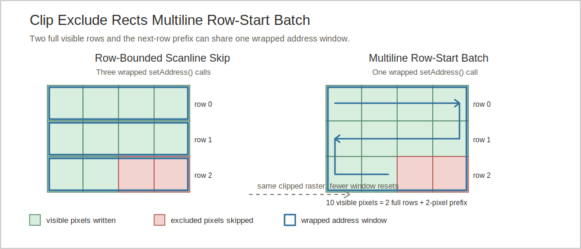

# Clip Exclude Rects Multiline Skip Design

Primary references:
[clip_exclude_rects.h](../src/roo_display/filter/clip_exclude_rects.h)
[clip_exclude_rects_test.cpp](../test/clip_exclude_rects_test.cpp)
[clip_exclude_rects.ino](../benchmarks/clip_exclude_rects.ino)
[clip_exclude_rects_scanline_skip_design.md](./clip_exclude_rects_scanline_skip_design.md)
[clipper.h](../../roo_windows/src/roo_windows/core/clipper.h)

## Status

Phase 1 is implemented in this change.

No update to [programming_guide.md](../doc/programming_guide.md) is required.
The optimization is internal to address-window filtering and does not change
caller-visible behavior or recommended usage.

## Objective

Reduce wrapped `setAddress()` calls and repeated `RectUnion::contains()` scans
in `RectUnionFilter::write()` and `RectUnionFilter::fill()` when a visible or
excluded run starts at `address_window_.xMin()`.

## Motivation

The scanline-skip work already amortizes point classification across
horizontal runs, but it still reopens the wrapped address window when a clear
run crosses a row boundary.

That leaves a common clipper pattern under-optimized:

- several fully visible rows from `xMin()` to `xMax()`, followed by
- one later row that stays visible only through a prefix.

Those rows can be streamed through one optimistic multiline address window.
Likewise, fully excluded rows can be skipped as one cached batch instead of
re-running the point query at each row start.

## Background

The earlier design in
[clip_exclude_rects_scanline_skip_design.md](./clip_exclude_rects_scanline_skip_design.md)
introduced the current row-local run skipping based on
`RectUnion::contains(x, y, &same_count)`.

That point query already returns a conservative horizontal lower bound:

- inside an exclusion box, it returns the first containing box extent,
- outside the exclusion, it returns the distance to the next future `xMin()` on
  the same row.

`RectUnionFilter` currently caches that answer in a row-bounded state and
recalculates whenever the cursor wraps to the next row. The wrapped output
therefore still sees one `setAddress()` call per fully visible row, even when
the same visible answer persists across multiple rows.

The existing full-window checks in `setAddress()` are already cheaper:

- if `intersects(address_window_)` is false, the whole window is visible,
- if `contains(address_window_)` is true, one exclusion box hides the whole
  window.

This design keeps those geometry checks, but folds them into the same generic
batch state used by the partial path.

## Requirements

- Preserve raster output and source-consumption semantics for `write()` and
  `fill()`.
- Reduce wrapped `setAddress()` calls when a visible batch begins at
  `address_window_.xMin()` and spans multiple rows.
- Reduce repeated `contains()` scans when the same row-start answer persists
  across many rows.
- Keep RAM neutral: reuse the current per-instance state instead of adding
  per-row caches or scratch buffers.
- Keep mid-row behavior conservative and fall back to the existing point-query
  semantics when a batch does not start at `xMin()`.
- Leave `writePixels()`, `fillPixels()`, `writeRects()`, and `fillRects()`
  unchanged.

## Design Overview

This design replaces the `kNone` / `kPartial` / `kFull` execution split with
one generic cached batch in `RectUnionFilter`:

- `run_remaining_`: guaranteed pixels left in the current batch,
- `run_excluded_`: whether that batch is excluded,
- `visible_window_open_`: whether the wrapped output already holds the
  optimistic address window for the current visible batch.

Whole-window fast paths fold into that state by seeding `run_remaining_` with
`address_window_.area()` and setting `run_excluded_` appropriately.

When the cursor is at `address_window_.xMin()`, the filter promotes a full-row
answer into a multiline batch with two new `RectUnion` helpers:

- `visiblePixelsFromRowStart(bounds, y)` returns a conservative row-major
  visible prefix: full visible rows plus the visible prefix of the first row
  where an exclusion appears.
- `excludedPixelsFromRowStart(bounds, y)` returns a conservative row-major
  excluded prefix: full rows proven by one full-width exclusion rectangle, plus
  the excluded prefix of the following row when the exclusion continues.

Visible batches open one wrapped address window that runs to `bounds.xMax()` on
the last row touched by the batch. If the batch ends in a prefix of that last
row, the trailing tail of the optimistic window stays unconsumed and the next
wrapped `setAddress()` resets the device, matching the existing single-row
strategy.



For a row-start batch with width $w$, full same-answer rows $r$, and a final
prefix $p$ on the first transition row, the conservative lower bound is:

$$
\text{batch\_pixels} = r \cdot w + p, \quad 0 \le p \le w
$$

## Design Details

### Row-Start Visible Batches

`visiblePixelsFromRowStart()` scans the rectangle list once to find the first
later row that intersects the address-window columns.

If no such row exists, the helper returns every remaining pixel in the address
window.

Otherwise it returns:

- every full visible row before the first blocked row, and
- the visible prefix on that blocked row, computed with one existing
  `contains(xMin, y, &same_count)` query.

This keeps the visible helper single-pass plus one point query, which is enough
to turn the sparse-exclusion case from one point query per row into one helper
scan per batch.

### Row-Start Excluded Batches

The excluded helper uses a stricter proof. It only extends across later full
rows when a single rectangle covers the full horizontal interval
`[bounds.xMin(), bounds.xMax()]`.

After that proven full-row block, the helper asks
`contains(xMin, next_y, &same_count)` once and reuses any excluded prefix on
the following row.

This is the chosen tradeoff. Arbitrary union-wide proof of full-row exclusion
would need interval-union logic or temporary per-row coverage state. That extra
CPU work and code complexity is not justified by the expected win for this
phase.

### Filter Control Flow

`RectUnionFilter::write()` and `RectUnionFilter::fill()` become generic batch
consumers:

1. If `run_remaining_ > 0`, consume up to that many pixels.
2. Otherwise, classify the cursor with `contains()`.
3. If the cursor is at `xMin()` and the whole row shares that answer, ask the
   row-start helper to extend the batch.
4. For visible batches, open the wrapped address window once for the rows
   covered by that batch.
5. Advance the cursor and keep the batch alive across row wraps until
   `run_remaining_` reaches zero.

The key decision is that row wraps no longer force recalculation by
themselves. Only exhausting the current batch does.

### Whole-Window Fast Paths

`setAddress()` still uses `intersects()` and `contains(const Box&)` to seed
entire-window batches:

- no intersection: `run_remaining_ = area`, `run_excluded_ = false`,
- one exclusion box fully contains the window:
  `run_remaining_ = area`, `run_excluded_ = true`.

The old enum disappears, but the cheap geometry checks stay because they avoid
even the first point query in the all-visible and singly-covered cases.

### Cost And Storage

The storage footprint stays effectively flat:

- `partial_run_remaining_` becomes `run_remaining_`,
- `partial_run_excluded_` becomes `run_excluded_`,
- `partial_row_window_open_` becomes `visible_window_open_`,
- the old exclusion enum disappears.

No persistent cache, lookup table, or temporary coverage buffer is added.

Rendering cost improves in two places:

- fewer wrapped `setAddress()` calls when clear rows stay clear from `xMin()`,
- fewer repeated `contains()` scans when the same row-start answer persists
  across multiple rows.

## Proposed API

The only public surface change is inside
[clip_exclude_rects.h](../src/roo_display/filter/clip_exclude_rects.h):

```cpp
uint32_t visiblePixelsFromRowStart(const Box& bounds, int16_t y) const;
uint32_t excludedPixelsFromRowStart(const Box& bounds, int16_t y) const;
```

These helpers are conservative lower bounds intended for
`RectUnionFilter`'s row-start batching logic. `RectUnionFilter` keeps its
existing public constructor and drawing API.

## Implementation Plan

Authoring reference:
[roo-display-code-authoring](../.github/skills/roo-display-code-authoring/SKILL.md)

### Phase 1: Land Row-Start Multiline Batches

Proposed commit message:

`Fold clip_exclude_rects row-start runs into multiline batches`

Work:

- add `RectUnion::visiblePixelsFromRowStart()` and
  `RectUnion::excludedPixelsFromRowStart()` as conservative row-start helpers,
- replace the enum-based execution split with generic `run_remaining_` and
  `run_excluded_` batch state,
- keep the whole-window fast paths by seeding whole-window batches in
  `setAddress()`,
- let `primeRun()` promote full-row answers at `xMin()` into multiline batches
  and open one optimistic wrapped address window for visible batches,
- add direct helper tests plus wrapped `setAddress()` counting regression tests,
  including split writes across a row wrap.

Validation:

- `bazel test //:clip_exclude_rects_test`

## Testing Plan

Primary validation is
[clip_exclude_rects_test.cpp](../test/clip_exclude_rects_test.cpp):

- helper tests cover clear-row and covered-row lower bounds,
- raster comparison tests keep `write()` and `fill()` output identical to the
  reference path,
- window-count tests assert that a row-start visible batch spanning multiple
  rows uses one wrapped `setAddress()` both in one call and across split
  writes.

If later follow-up broadens the surface beyond this unit target, add compile
coverage with `bazel test //:products_compile_test`.

## Caveats

- The excluded helper is intentionally conservative. If a full-width excluded
  block is assembled from multiple rectangles, this phase may still fall back
  to smaller batches.
- Mid-row visible segments still use the existing point-query lower bound and
  may reopen the wrapped address window per segment. The optimization targets
  the row-start cases that dominate clipper output.

### Rejected Alternatives

#### Prove Full-Width Exclusion From Arbitrary Rectangle Unions

Rejected because it needs interval-union logic or temporary row coverage state
to prove that adjacent or overlapping rectangles cover
`[bounds.xMin(), bounds.xMax()]`. That machinery adds CPU work and code
complexity to an internal fast path whose dominant wins already come from the
single-rectangle and all-visible cases.

#### Keep Separate `kNone` / `kFull` Control Flow

Rejected because it duplicates the consumer logic in `write()` and `fill()`.
Seeding whole-window batches preserves the existing fast-path win while letting
one batch consumer handle visible, excluded, and partial windows.

## Future Work

- Extend [clip_exclude_rects.ino](../benchmarks/clip_exclude_rects.ino) to
  report wrapped `setAddress()` counts alongside elapsed time for sparse
  clipper masks.
- Revisit stronger excluded-row proofs only if profiling shows real workloads
  dominated by full-width exclusion assembled from many rectangles.