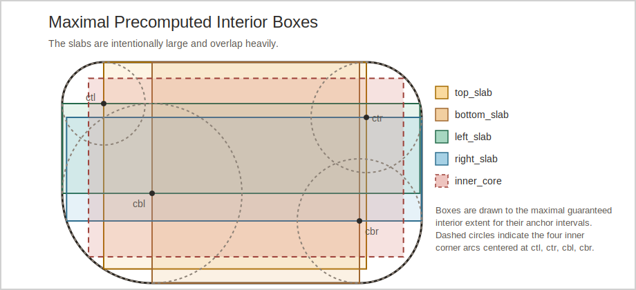
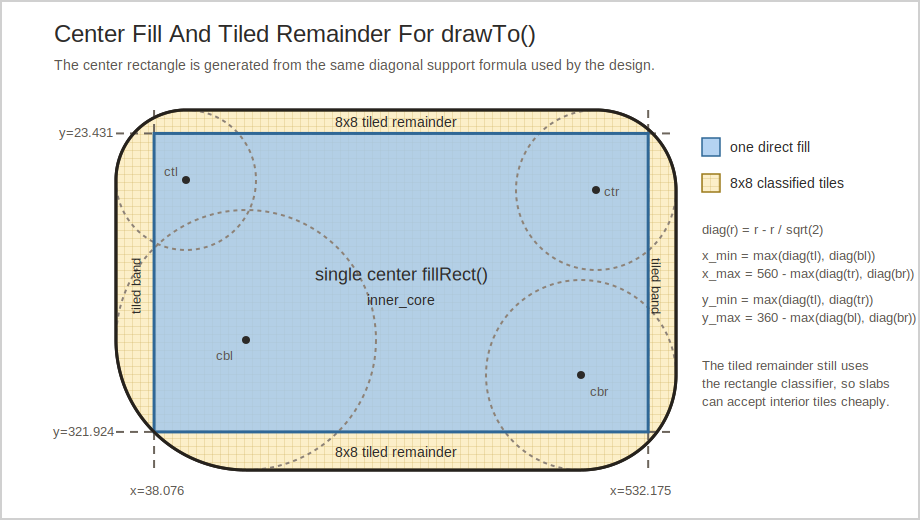

# Smooth Round Rect Corner Radii Design

Primary references:
[smooth_round_rect_inner_boundary_design.md](smooth_round_rect_inner_boundary_design.md)
[src/roo_display/shape/smooth.h](../src/roo_display/shape/smooth.h)
[src/roo_display/shape/smooth.cpp](../src/roo_display/shape/smooth.cpp)
[doc/programming_guide.md](../doc/programming_guide.md)
[images/smooth_round_rect_corner_slabs.svg](images/smooth_round_rect_corner_slabs.svg)
[images/smooth_round_rect_corner_center_fill.svg](images/smooth_round_rect_corner_center_fill.svg)

## Objective

Add a new smooth rounded-rectangle API in
[src/roo_display/shape/smooth.h](../src/roo_display/shape/smooth.h) that
allows the four corner radii to be specified individually while preserving the
corrected equal-radius behavior, performance, and `SmoothShape` object size.

This design assumes the inner-boundary correction in
[smooth_round_rect_inner_boundary_design.md](smooth_round_rect_inner_boundary_design.md)
has landed. The four-radii work extends that normalization model instead of
preserving the older fixed-inner-center behavior.

## Motivation

The current smooth round-rect API only supports one radius shared by all four
corners. That is sufficient for many controls, but it does not cover shapes
such as cards, callouts, sheets, pills with one squared edge, or transitions
between components with different top and bottom curvature.

The new API fits naturally into the existing smooth-shape family. It looks like
a round-rect call, but takes a small radii struct instead of a single scalar.

The implementation also needs one coherent model for thick outlines. The
equal-radius inner-boundary fix defines that model; this design generalizes it
to four independent centerline radii.

## Background

Smooth round rects are currently implemented as a dedicated `SmoothShape`
variant in [src/roo_display/shape/smooth.h](../src/roo_display/shape/smooth.h)
and [src/roo_display/shape/smooth.cpp](../src/roo_display/shape/smooth.cpp).
The equal-radius path has specialized support for:

- construction and geometry normalization,
- per-pixel color evaluation,
- rectangle classification for readback and drawing,
- a dedicated `PixelStream` fast path,
- and a dedicated draw path.

That specialization matters because round rects are common, and the equal-
radius version already has a tuned path that remains isolated from the more
general implementation.

After the inner-boundary design lands, the equal-radius `RoundRect` payload and
helpers distinguish the normalized inner-boundary shape from the outer
boundary. In particular, thick outlines derive:

- outer bounds from the centerline bounds expanded by `thickness / 2`,
- inner bounds from the centerline bounds inset by `thickness / 2`,
- outer radii from centerline radii plus `thickness / 2`,
- inner radii from `max(0, centerline_radius - thickness / 2)`,
- and a filled fold when the inner bounds collapse in either axis.

The four-radii implementation uses the same centerline-normalization contract.

### Existing Footprint Estimate On ESP32

Assuming ESP32-class targets with 32-bit `float`, 32-bit `Color`, 8-byte
`Box`, 4-byte enum storage, and normal 4-byte struct alignment:

| Type | Estimated size |
| --- | ---: |
| `Color` | 4 bytes |
| `Box` | 8 bytes |
| corrected `SmoothShape::RoundRect` | 84 bytes |
| `SmoothShape::Arc` | 116 bytes |
| `SmoothShape` | 128 bytes |

The corrected equal-radius `RoundRect` estimate from the inner-boundary design
is:

- 8 floats for geometry and cached squared radii: 32 bytes,
- 4 floats for explicit inner rectangle bounds: 16 bytes,
- 1 small inner-boundary mode field with normal alignment padding: 4 bytes,
- 2 colors: 8 bytes,
- 3 helper boxes: 24 bytes.

Total: about 84 bytes.

`SmoothShape` itself is currently dominated by the `Arc` union member rather
than by `RoundRect`. That is important because it means there is some storage
headroom for a new round-rect payload, but not enough to add arbitrary cached
state without checking the union ceiling.

## Requirements

- The public API must remain aligned with the smooth-shape family and return
  `SmoothShape`.
- The new API must accept a struct rather than four separate radius arguments.
- The radii struct must support positional aggregate use such as
  `RoundRectRadii{2, 3, 4, 5}`.
- The struct must expose named fields so designated initialization is
  possible on toolchains that support it, for example
  `RoundRectRadii{.tl = 2, .tr = 3, .bl = 4, .br = 5}`.
- The existing equal-radius overloads must remain available.
- The inner-boundary correction in
  [smooth_round_rect_inner_boundary_design.md](smooth_round_rect_inner_boundary_design.md)
  must land first.
- Four-radii normalization must extend the corrected centerline-based
  normalization model from the inner-boundary design.
- When the effective centerline radii are equal after normalization, the
  implementation must reuse the corrected equal-radius path.
- When normalized inner bounds collapse in either axis, the implementation must
  fold to a filled outer round rect in the outline color.
- The unequal-radius implementation must be separate so the common equal-
  radius case does not pay additional per-pixel or per-stream overhead.
- Internal helper reuse is desirable, but not at the cost of slowing down the
  equal-radius path.
- The design must avoid increasing `sizeof(SmoothShape)`.
- The design must document RAM impact and rendering-cost tradeoffs.
- Public documentation must be updated when the feature is implemented.
- Until the unequal-radius payload is implemented, the public radii overloads
  must not silently drop unsupported unequal inputs. The interim behavior is to
  emit `LOG(WARNING) << "Unimplemented: unequal smooth round-rect radii"` and
  return an empty shape for unequal effective radii.

## Design Overview

Introduce a new public value type, `RoundRectRadii`, and add overloads of the
smooth round-rect factory functions that accept it by `const&`.

Implementation splits into two paths:

- equal effective centerline radii: reuse the corrected
  `SmoothShape::RoundRect` path from the inner-boundary design,
- unequal effective centerline radii: create a new `SmoothShape` kind with its
  own payload and helper functions.

The unequal-radius path will share low-level geometry utilities where doing
so does not introduce extra branching into the corrected equal-radius fast path.
At a minimum, construction-time normalization and some corner-distance math can
be shared. The top-level streaming, readback, and drawing helpers remain
separate.

The unequal-radius variant uses the available union headroom for values that
are used by the hot geometry tests. It stores outer boundary extents, four
outer radii, outline thickness, per-corner adjusted squared radii for both the
outer and derived inner boundaries, two colors, and five guaranteed-interior
helper boxes. It does not store explicit inner bounds because they are always
the outer bounds inset by `thickness`. It does not store the four raw inner
radii because each is always `max(0, outer_radius - thickness)` after
centerline normalization, and deriving that value is cheaper than recomputing
the squared-radius thresholds in every evaluator, classifier, and stream row.

This is intentionally different from the corrected equal-radius `RoundRect`
retrofit. That payload preserves the existing shared corner-center storage,
not outer boundary extents plus thickness. Once the corrected inner radius
collapses to zero, `ri` no longer carries the original outline thickness, so
the rectangular inner boundary needs explicit bounds. The unequal-radius
payload is new, so it chooses outer boundary extents plus thickness as its
canonical storage and derives the inner rectangle directly from those values.

The unequal-radius payload therefore remains at the current `Arc` union
ceiling. There is no additional coarse cache in the selected layout. Empty
helper boxes represent degenerate cases, and the adjusted-square caches are the
only extra per-corner cache beyond the public geometry.

## Design Details

### Public Radii Type

Add a small aggregate type in
[src/roo_display/shape/smooth.h](../src/roo_display/shape/smooth.h):

```cpp
struct RoundRectRadii {
  float tl;
  float tr;
  float bl;
  float br;
};
```

The field order follows the intended aggregate call style shown above. The
implementation will treat the fields by name rather than by any geometric
ordering assumption.

The public overloads take the radii by `const RoundRectRadii&`.
This keeps aggregate-call syntax, binds cleanly to temporaries, and avoids an
unconditional 16-byte by-value copy at each public API entry point.

### Geometry Semantics

The new overloads use the corrected smooth round-rect semantics from
[smooth_round_rect_inner_boundary_design.md](smooth_round_rect_inner_boundary_design.md):

- `x0`, `y0`, `x1`, and `y1` describe the outline centerline extents,
- `thickness` expands the outer boundary by `thickness / 2`,
- the inner boundary shrinks inward from the centerline by `thickness / 2`,
- and filled shapes are represented as the zero-thickness special case.

Corner radii in `RoundRectRadii` are centerline radii. Construction derives
outer radii as `centerline_radius + thickness / 2` and inner radii as
`max(0, centerline_radius - thickness / 2)` for each corner. The inner bounds
are the ordered centerline bounds inset by `thickness / 2`; when those bounds
collapse in either axis, the shape folds to a filled outer round rect in the
outline color.

### Radius Normalization

Normalize the input as follows:

1. Clamp all input radii to be non-negative.
2. Normalize rectangle ordering so `x0 <= x1` and `y0 <= y1`.
3. Clamp thickness to be non-negative and compute `delta = thickness / 2`.
4. Compute the centerline width and height.
5. If the four centerline radii do not fit the centerline bounds, scale them
  by a single factor:

$$
scale = \min\left(
  1,
  \frac{width}{tl + tr},
  \frac{width}{bl + br},
  \frac{height}{tl + bl},
  \frac{height}{tr + br}
\right)
$$

6. Derive outer bounds by expanding the centerline bounds by `delta`.
7. Derive inner bounds by insetting the centerline bounds by `delta`.
8. Derive outer radii as `r_q + delta` and inner radii as
   `max(0, r_q - delta)` for each corner.
9. If the normalized inner bounds collapse in either axis, fold to a filled
   outer round rect in the outline color.

Using one global scale factor preserves proportions and guarantees that all
adjacent centerline radius pairs fit simultaneously. Because outer bounds grow
by the same `delta` that is added to every outer radius, and inner bounds shrink
by the same `delta` that is subtracted from every inner radius, pairwise fits
remain valid for both derived boundaries.

### Equal-Radius Fold

After normalization, if the effective centerline radii are all equal, dispatch
to the corrected single-radius `SmoothThickRoundRect()` builder.

This keeps:

- the corrected equal-radius payload,
- the corrected equal-radius dedicated `RoundRectStream`,
- the corrected equal-radius readback helpers,
- and the corrected equal-radius tuned draw path.

The fold must happen after normalization rather than on raw input so cases
that start unequal but clamp or globally scale to the same effective centerline
radii still use the corrected equal-radius implementation. The filled fold from the
inner-boundary design is applied before choosing between the equal-radius and
unequal-radius payloads.

### Unequal-Radius Shape Kind

Add a new `SmoothShape` kind only for genuinely unequal effective centerline
radii, for example `ROUND_RECT_CORNERS`, together with a separate payload
struct. Equal effective radii, including rectangular-inner and filled-fold
degeneracies from the inner-boundary design, stay in the corrected
`SmoothShape::RoundRect` path.

#### Selected Stored Radius Representation

The unequal-radius payload uses this stored representation:

- outer boundary extents after thickness expansion,
- 4 outer radii,
- outline thickness,
- 4 precomputed outer adjusted squared radii,
- 4 precomputed inner adjusted squared radii,
- outline and interior colors,
- and 5 precomputed maximal interior helper boxes.

This mirrors the corrected equal-radius `RoundRect` payload's philosophy. The
equal-radius path stores `ro`, `ri`, `ro_sq_adj`, and `ri_sq_adj` because the
same values are reused by every corner. The unequal-radius path stores the
per-corner values that are expensive to recompute (`ro_sq_adj[4]` and
`ri_sq_adj[4]`) and reconstructs only the raw inner radius:

```text
ri_q = max(0, ro_q - thickness)
```

This derivation remains correct under the inner-boundary design. After
centerline normalization, `ro_q` is `centerline_radius_q + thickness / 2`, so
`ro_q - thickness` is exactly `centerline_radius_q - thickness / 2`. Different
corners can therefore collapse independently: a corner whose reconstructed
`ri_q` is zero is treated as sharp, while a neighboring corner with positive
`ri_q` remains rounded.

The inner rectangle follows the same stored-state rule:

$$
\begin{aligned}
inner\_x0 &= outer\_x0 + thickness \\
inner\_y0 &= outer\_y0 + thickness \\
inner\_x1 &= outer\_x1 - thickness \\
inner\_y1 &= outer\_y1 - thickness
\end{aligned}
$$

The corrected equal-radius payload stores explicit inner rectangle bounds
because it retrofits the existing `RoundRect` representation, whose `x0`,
`y0`, `x1`, and `y1` are the shared corner-center rectangle. In the
rectangular-inner case, that shared corner-center rectangle is not the inner
rectangle, and the original thickness is not recoverable from the clamped
inner radius. The unequal-radius payload has no such compatibility constraint:
it stores outer boundary extents and thickness, so all four inner rectangle
bounds are simple derived locals. Storing them anyway would add 16 bytes to a
payload already estimated at the `Arc` ceiling.

The rejected payload and radius layouts are recorded in Caveats. The selected
layout is the only one that fits inside the current `Arc` ceiling while
caching adjusted squared radii for every corner.

#### Payload Layout

The payload layout is:

- 4 floats for outer boundary extents: 16 bytes,
- 4 floats for outer radii: 16 bytes,
- 1 float for thickness: 4 bytes,
- 4 floats for outer adjusted squared radii: 16 bytes,
- 4 floats for inner adjusted squared radii: 16 bytes,
- 2 colors: 8 bytes,
- 5 helper boxes (`inner_core`, `top_slab`, `bottom_slab`, `left_slab`,
  `right_slab`): 40 bytes.

Estimated total: 116 bytes, matching the current `SmoothShape::Arc` estimate.

That is about 32 bytes larger than the corrected equal-radius `RoundRect`
payload, but it does not increase `sizeof(SmoothShape)` as long as `Arc`
continues to define the union ceiling.

For each corner `q`, construction computes:

```text
ro_q = normalized centerline radius q + thickness / 2
ri_q = max(0, ro_q - thickness)
ro_sq_adj_q = ro_q * ro_q + 0.25
ri_sq_adj_q = ri_q * ri_q + 0.25
```

Only `ro_q`, `thickness`, `ro_sq_adj_q`, and `ri_sq_adj_q` are stored. The
derived `ri_q` is reconstructed as a local when a corner or row needs it.

#### Cost Analysis

The equal-radius evaluator performs the canonical anti-aliased boundary tests:

```text
d_sq <= ro_sq_adj - ro          // fully inside outer
d_sq >= ro_sq_adj + ro          // fully outside outer
d_sq <= ri_sq_adj - ri          // fully inside inner, when ri >= 0.5
d_sq >= ri_sq_adj + ri          // fully outside inner
```

The unequal-radius evaluator uses the same tests after selecting the relevant
corner. Caching `ro_sq_adj_q` and `ri_sq_adj_q` means that a corner AA pixel
does not recompute `ro_q * ro_q + 0.25` and `ri_q * ri_q + 0.25`. Compared
with storing raw inner radii and recomputing adjusted squares, the selected
layout removes two floating-point multiplies per corner AA pixel and adds one
subtract plus one clamp to reconstruct `ri_q`.

That tradeoff is intentionally not based only on the original Xtensa ESP32
with a single-precision FPU. The code can run on other ESP32-family chips,
RISC-V variants, and non-ESP targets, and some builds have no hardware
floating-point unit. On FPU targets, avoiding repeated multiplies shortens the
hot AA path. On soft-float targets, a floating-point multiply can expand to
software helper code, so replacing repeated multiplies with cached loads and a
subtract/clamp is an even stronger win. On targets where memory loads dominate,
the selected layout still does not increase `sizeof(SmoothShape)`, and it
matches the existing equal-radius choice to cache adjusted squared radii.

The selected storage does not reduce the number of square roots needed for
anti-aliased boundary blending. That cost is controlled by the method-specific
algorithms below: `readColorRect()` and `drawTo()` isolate boundary regions,
and `createStream()` amortizes row crossings in the stream object rather than
adding persistent shape fields.

### Footprint Delta Discussion

There are two relevant footprint questions.

First, the payload itself grows for the unequal-radius variant:

- corrected equal-radius round-rect payload: about 84 bytes,
- proposed unequal-radius payload: about 116 bytes,
- payload delta: about 32 bytes.

Second, the actual object footprint of `SmoothShape` remains unchanged:

- current `SmoothShape`: about 128 bytes,
- proposed `SmoothShape`: still about 128 bytes,
- object-size delta: 0 bytes.

This works only if the new payload does not grow past the existing `Arc`
member size. The selected layout spends all of the useful headroom on the
per-corner adjusted-square caches, because those values are read in every
corner pixel test, corner-rectangle classifier, and stream row. The layout does
not reserve space for stream-specific boundary trackers, precomputed per-row
state, maximum/minimum coarse squared-radius caches, or flags. Those values are
either derivable from the stored fields or local to a stream instance, where
they do not affect `SmoothShape` size.

The implementation must include a compile-time guard such as:

```cpp
static_assert(sizeof(SmoothShape::RoundRectCorners) <=
              sizeof(SmoothShape::Arc));
```

The storage decision does not require a microbenchmark gate. It is selected by
object-size accounting plus the operation-count analysis above. Benchmarks are
still useful for validating the final stream and draw implementations, but not
for choosing whether to store raw inner radii.

### Interior Slabs And Helper Boxes

Precompute 5 axis-aligned boxes that are guaranteed to lie entirely inside the
inner shape:

- `top_slab`,
- `bottom_slab`,
- `left_slab`,
- `right_slab`,
- `inner_core`.

Construction computes derived inner radii for the slab calculations; these are
construction locals and are not stored in the payload.

Let the normalized inner rectangle after thickness inset be:

- `L`, `T`, `R`, `B` for the inset edges,
- `ctl = (L + ri_tl, T + ri_tl)`,
- `ctr = (R - ri_tr, T + ri_tr)`,
- `cbl = (L + ri_bl, B - ri_bl)`,
- `cbr = (R - ri_br, B - ri_br)`.

Define the inner-boundary support functions:

```text
top_inside(x) = max(
  T,
  x < ctl.x ? ctl.y - sqrt(max(0, ri_tl^2 - (x - ctl.x)^2)) : T,
  x > ctr.x ? ctr.y - sqrt(max(0, ri_tr^2 - (x - ctr.x)^2)) : T)

bottom_inside(x) = min(
  B,
  x < cbl.x ? cbl.y + sqrt(max(0, ri_bl^2 - (x - cbl.x)^2)) : B,
  x > cbr.x ? cbr.y + sqrt(max(0, ri_br^2 - (x - cbr.x)^2)) : B)

left_inside(y) = max(
  L,
  y < ctl.y ? ctl.x - sqrt(max(0, ri_tl^2 - (y - ctl.y)^2)) : L,
  y > cbl.y ? cbl.x - sqrt(max(0, ri_bl^2 - (y - cbl.y)^2)) : L)

right_inside(y) = min(
  R,
  y < ctr.y ? ctr.x + sqrt(max(0, ri_tr^2 - (y - ctr.y)^2)) : R,
  y > cbr.y ? cbr.x + sqrt(max(0, ri_br^2 - (y - cbr.y)^2)) : R)
```

Then define the helper boxes as the maximal guaranteed-interior boxes for the
chosen anchor intervals:

- `top_slab = [ctl.x, ctr.x] x [T,
  min(bottom_inside(ctl.x), bottom_inside(ctr.x))]`,
- `bottom_slab = [cbl.x, cbr.x] x
  [max(top_inside(cbl.x), top_inside(cbr.x)), B]`,
- `left_slab = [L, min(right_inside(ctl.y), right_inside(cbl.y))] x
  [ctl.y, cbl.y]`,
- `right_slab = [max(left_inside(ctr.y), left_inside(cbr.y)), R] x
  [ctr.y, cbr.y]`.

Define:

```text
diag(r) = r - r / sqrt(2)
```

and then:

- `inner_core = [L + max(diag(ri_tl), diag(ri_bl)),
  R - max(diag(ri_tr), diag(ri_br))] x
  [T + max(diag(ri_tl), diag(ri_tr)),
  B - max(diag(ri_bl), diag(ri_br))]`.

These boxes are intentionally large and they are expected to overlap heavily.
That overlap is beneficial: each box is a cheap guaranteed-interior accept, and
their union covers most of the non-AA interior for many asymmetric shapes.
`inner_core` has one additional role: it is the draw path's center fill
rectangle, analogous to the existing equal-radius `inner_mid` box. The other
four slabs are classifier accelerators for points, readback rectangles, and
the 8x8 tiles surrounding the direct center fill.

Any helper box can still become empty for thin or degenerate geometries. In
that case it is simply omitted.

Because the helper boxes drive both classification and drawing, the figure
below is part of the geometry contract and should stay synchronized with the
formulas that define the slabs.



### Method-Specific Geometry Paths

The unequal-radius implementation uses a separate helper family from the
corrected equal-radius round-rect helpers. The helpers are organized around the
public `Rasterizable`/`Drawable` methods they serve.

The `Rasterizable` contract is important for the hot paths. `readColors()`,
`readColorRect()`, and `readUniformColorRect()` are called with points or
rectangles already inside `extents()`. The explicit out-of-bounds API is
`readColorsMaybeOutOfBounds()`, which filters coordinates before delegating to
`readColors()`. The unequal-radius helpers therefore do not re-check the
integer extents in their normal method paths. They still classify transparent
pixels and rectangles inside those extents, especially in the rounded corner
areas where the rectangular bounds include pixels outside the curved shape.

#### `readColors()`: Point Samples

`readColors()` is the point-sampling path. It mirrors the equal-radius
`ReadRoundRectColors()` flow: test guaranteed-interior helper boxes first, then
fall through to a per-pixel evaluator.

The unequal-radius evaluator uses this fixed decision order:

1. If the pixel is in any precomputed interior helper box, return the interior
   color.
2. If the pixel lies in a corner region, evaluate the relevant outer and inner
  corner tests using the derived outer and inner corner centers, stored outer
  radius, derived inner radius, and cached adjusted-square values.
3. Otherwise evaluate the nearest straight edge band using the corresponding
  outer edge and the corresponding inner edge.

The rounded-corner path mirrors the corrected equal-radius tests, with separate
outer and inner distances when the inner boundary no longer shares the outer
corner center:

```text
ri = max(0, ro - thickness)
outer_d_sq = outer_dx * outer_dx + outer_dy * outer_dy
inner_d_sq = inner_dx * inner_dx + inner_dy * inner_dy

fully_inside_inner = ri >= 0.5 && inner_d_sq <= ri_sq_adj - ri
fully_outside_outer = outer_d_sq >= ro_sq_adj + ro
fully_inside_outer = outer_d_sq <= ro_sq_adj - ro
fully_outside_inner = ri == 0 || inner_d_sq >= ri_sq_adj + ri
```

For corners where `ri == 0`, the inner boundary is a sharp rectangle corner;
the evaluator uses the inner straight-edge tests rather than treating the zero
radius as a rounded corner. Only pixels that are not classified by these
comparisons compute a square root for anti-aliasing. The straight-edge path
uses signed distance to the outer and inner horizontal or vertical edge, so it
does not need a square root.

#### `readUniformColorRect()`: Conservative Rect Classification

`readUniformColorRect()` is the allocation-free uniform-color probe. It plays
the same role as the equal-radius `DetermineRectColorForRoundRect()` call used
by the current `readUniformColorRect()` implementation: return a color only
when the rectangle is provably transparent, interior, or outline; otherwise
return non-uniform.

The classifier uses this order:

1. Test containment in the five precomputed interior helper boxes.
2. Test rectangles wholly inside one corner quadrant with corner-local squared
   distance bounds, including fully transparent corner rectangles.
3. Test rectangles wholly inside a straight edge band.
4. Return non-uniform for rectangles that cross multiple curved boundaries or
   intersect an AA transition.

For a rectangle wholly in one corner region, classification is constant-time.
Let `outer_nearest_sq` and `outer_farthest_sq` be squared-distance bounds to
the outer corner center, and let `inner_nearest_sq` and `inner_farthest_sq` be
the corresponding bounds to the inner corner center when `ri > 0`. Then:

- `outer_nearest_sq >= ro_sq_adj + ro` means fully transparent,
- `ri > 0` and `inner_farthest_sq <= ri_sq_adj - ri` means fully interior,
- `outer_farthest_sq <= ro_sq_adj - ro` and either `ri == 0` or
  `inner_nearest_sq >= ri_sq_adj + ri` means fully outline,
- otherwise the rectangle is mixed.

When `ri == 0`, interior classification comes from the straight inner bounds
and helper boxes rather than a zero-radius corner test.

No square root is required for these rectangle decisions. This is deliberately
similar to the equal-radius classifier, but generalized from one radius and one
corner-center rectangle to four independent corner centers and thresholds.

#### `readColorRect()`: Rectangle Readback For Composition

`readColorRect()` is the rectangle readback path used by rasterizable
composition. `RasterizableStack::readColorRect()` asks each layer for a
rectangle, blends uniform layers cheaply, and otherwise allocates and blends a
full rectangle buffer. The unequal-radius implementation must therefore return
uniform results for common transparent, interior, and outline rectangles. For
mixed rectangles, the first implementation keeps the fallback simple because
composition usually asks for small rectangles, commonly no larger than 8x8.

The equal-radius implementation first calls `DetermineRectColorForRoundRect()`;
when that returns non-uniform, it evaluates every pixel in the requested
rectangle. The unequal-radius path follows that same readback shape after the
whole-rectangle classifier: if the rectangle is not uniform, evaluate exactly
the requested pixels with the unequal-radius point evaluator. This keeps
composition behavior predictable and bounds the worst common fallback to the
small readback rectangle size rather than adding a second subdivision system to
the initial implementation.

#### `drawTo()`: Center Fill And Tiled Remainder

`drawTo()` owns the shape subdivision used for direct rendering. The initial
unequal-radius draw path follows the optimization that motivates the current
equal-radius implementation: draw the largest cheap guaranteed-interior
rectangle in one `fillRect()` call, then tile the remaining boundary bands.

For equal radii, the current draw path splits around `inner_mid`, fills that
interior directly, and subdivides the remaining top/left/right/bottom bands
into 8x8 tiles. For unequal radii, `inner_core` is the direct generalization of
`inner_mid`: it is the maximal center rectangle derived from the per-corner
diagonal support distances and guaranteed to lie inside the inner shape.

The draw-path partition below is likewise part of the rendering argument and
should be kept in sync with the center-fill formulas.



When `inner_core` is non-empty and wider than 16 pixels, matching the current
equal-radius split threshold, `drawTo()` intersects it with the requested draw
box and fills that clipped rectangle directly with the pre-blended interior
color. It then tiles the four remaining rectangles around it:

- the top band above `inner_core`,
- the left band beside `inner_core`,
- the right band beside `inner_core`,
- and the bottom band below `inner_core`.

Each 8x8 tile uses the unequal-radius rectangle classifier. Fully transparent,
interior, and outline tiles are filled directly; only mixed AA tiles fall back
to per-pixel evaluation. The `top_slab`, `bottom_slab`, `left_slab`, and
`right_slab` helper boxes still matter here because they let the classifier
accept many interior tiles in the tiled bands without per-pixel work.

If `inner_core` is empty or too narrow to be worth splitting, `drawTo()` tiles
the entire requested draw box. This mirrors the corrected equal-radius behavior
for narrow round rects and avoids adding small extra address-window operations.

#### `createStream()`: Row-Major Streaming

The equal-radius `RoundRectStream` remains unchanged and exclusive to the
existing equal-radius kind. For the new unequal-radius kind, the design includes
a dedicated stream override rather than relying on the generic
`Rasterizable::createStream()` fallback.

The equal-radius stream classifies each scanline into left cap, center span,
and right cap, maintaining doubled-coordinate threshold trackers so it avoids a
square root on every row. The unequal-radius stream follows the same principle
with per-corner row trackers stored in the stream object, not in `SmoothShape`.
For each scanline, only the active top or bottom corner pair participates in
the arc crossings; straight middle rows reduce to edge/interior spans.

Helper slabs are not consulted by the row classifier. Once the row-local arc
crossing intervals are known, interior and outline spans are already classified,
and slab containment tests add work without improving the result. Slabs are
owned by rectangle-bounded classifiers such as `drawTo()`,
`readUniformColorRect()`, and `readColorRect()`, where 2D containment is the
useful short-circuit.

The implementation target is the best shape-specific stream the stored geometry
supports: obvious runs are emitted as fills, and per-pixel work is limited to
AA boundary segments and genuinely mixed corner spans.

### Helper Reuse Boundaries

The design reuses internals selectively.

Good reuse candidates:

- construction-time normalization,
- common outline/interior alpha blending logic,
- corner-local annulus evaluation helpers,
- and shared draw-subdivision scaffolding.

Poor reuse candidates:

- the equal-radius rectangle classifier,
- the equal-radius dedicated stream,
- and any helper that would inject extra branches into the current equal-
  radius fast path.

## Proposed API

Add overloads like the following:

```cpp
struct RoundRectRadii {
  float tl;
  float tr;
  float bl;
  float br;
};

SmoothShape SmoothRoundRect(float x0, float y0, float x1, float y1,
             const RoundRectRadii& radii, Color color,
                            Color interior_color = color::Transparent);

SmoothShape SmoothThickRoundRect(float x0, float y0, float x1, float y1,
               const RoundRectRadii& radii,
               float thickness,
                                 Color color,
                                 Color interior_color = color::Transparent);

SmoothShape SmoothFilledRoundRect(float x0, float y0, float x1, float y1,
                const RoundRectRadii& radii, Color color);
```

The existing single-radius overloads remain unchanged.

Example use:

```cpp
dc.draw(SmoothFilledRoundRect(20, 20, 120, 80,
                              RoundRectRadii{8, 8, 20, 20},
                              color::Blue));

dc.draw(SmoothThickRoundRect(20, 100, 120, 160,
                             RoundRectRadii{.tl = 4, .tr = 12,
                                            .bl = 20, .br = 6},
                             3, color::Black, color::White));
```

The designated-initializer form depends on toolchain support. The API itself
only requires that the struct be a simple aggregate with named fields.

Interim behavior between Phase 1 and Phase 2 is explicit: unequal effective
radii emit `LOG(WARNING) << "Unimplemented: unequal smooth round-rect radii"`
and return an empty shape. Equal effective radii and filled folds use the
corrected equal-radius path.

## Implementation Plan

Authoring reference:
[roo-display-code-authoring](../.github/skills/roo-display-code-authoring/SKILL.md)

Prerequisite state:

- [smooth_round_rect_inner_boundary_design.md](smooth_round_rect_inner_boundary_design.md)
  has landed,
- `internal::NormalizeSingleRadiusRoundRect()` exists,
- and the corrected equal-radius `SmoothShape::RoundRect` path handles rounded
  inner bounds, rectangular inner bounds, and filled folds.

### Phase 1: Public API And Four-Radii Normalization

Proposed commit message:

`Add smooth round-rect corner radii API`

Work:

- add `RoundRectRadii` to
  [src/roo_display/shape/smooth.h](../src/roo_display/shape/smooth.h),
- add the three public overloads taking `const RoundRectRadii&`,
- add internal four-radii normalization that extends the corrected
  centerline-based single-radius helper,
- implement non-negative radius clamp, centerline global-fit scaling, corrected
  outer and inner bound derivation, and filled-fold detection,
- route equal effective centerline radii through the corrected single-radius
  builder,
- emit `LOG(WARNING) << "Unimplemented: unequal smooth round-rect radii"` and
  return an empty shape for unequal effective radii until the payload lands,
- and keep the existing single-radius overloads intact.

Validation:

- `//:products_compile_test` for public API compile coverage,
- and a focused unit test that normalized equal radii still produce the same
  rendered result through old and new overloads,
- direct normalization tests for equal radii, globally scaled radii, filled
  folds, and unequal interim behavior.

### Phase 2: Unequal-Radius Payload And Storage Guardrails

Proposed commit message:

`Add unequal smooth round-rect payload`

Work:

- add the new unequal-radius `SmoothShape` kind and payload with outer boundary
  extents, four outer radii, thickness, per-corner adjusted-square caches,
  colors, and five helper boxes,
- wire construction to create that payload for unequal effective centerline
  radii,
- and add compile-time size guards so the new payload cannot grow past the
  current union ceiling unnoticed.

Validation:

- a unit test that exercises unequal input collapsing to equal effective
  centerline radii and confirms it behaves like the corrected equal-radius
  implementation,
- and a compile-time size check guarding `sizeof(SmoothShape)` indirectly via
  the new payload limit and directly checking that the new payload fits within
  `SmoothShape::Arc`.

### Phase 3: Helper Boxes, Slabs, And Pixel Evaluation

Proposed commit message:

`Evaluate unequal smooth round-rect pixels`

Work:

- compute outer and inner corner centers, support functions, and maximal helper
  boxes from the corrected normalization output,
- implement the unequal-radius per-pixel color evaluator,
- implement the fixed evaluator order: helper-box accept, outer/inner corner
  evaluation, then straight-edge evaluation, relying on the `Rasterizable`
  in-bounds contract instead of re-checking integer extents,
- and use the precomputed overlapping boxes to keep the common interior queries
  cheap.

Validation:

- `//:smooth_shapes_test` cases for filled, outlined, and thick asymmetric
  round rects,
- focused render checks that cover empty or degenerate helper-box cases,
- and cases where some inner corner radii collapse to zero while others remain
  positive.

### Phase 4: Readback And Uniform-Rect Classification

Proposed commit message:

`Classify unequal smooth round-rect rectangles`

Work:

- add unequal-radius helpers for `readColors()`, `readColorRect()`, and
  `readUniformColorRect()`,
- implement conservative rectangle classification using helper boxes,
  straight-edge checks, and corner-local squared-distance checks, assuming the
  input rectangle is within `extents()` as required by `Rasterizable`,
- implement `readColorRect()` as a whole-rectangle classifier followed by
  per-pixel fallback for mixed rectangles, matching the corrected equal-radius
  readback shape and the small rectangles normally requested by composition,
- and keep `readUniformColorRect()` conservative and allocation-free.

Validation:

- `//:read_uniform_color_rect_test` for guaranteed interior, guaranteed
  transparent, and boundary-adjacent regions,
- add a focused `//:read_color_rect_test` target for stack-sized rectangles
  that hit slabs, corner quadrants, and mixed AA pixels,
- and regression checks that mixed-color regions still correctly report
  non-uniform.

### Phase 5: Draw Path Integration

Proposed commit message:

`Draw unequal smooth round rects efficiently`

Work:

- add the new unequal-radius draw helper,
- wire `drawTo()` through the new shape kind,
- preserve the corrected equal-radius draw path unchanged,
- implement the center-fill partition shown in
  [images/smooth_round_rect_corner_center_fill.svg](images/smooth_round_rect_corner_center_fill.svg),
  filling the clipped `inner_core` rectangle directly and tiling the four
  surrounding bands,
- and use subdivision logic analogous to the current round-rect path, but with
  helper-box fills, straight-edge classification, corner classification, and
  8x8 fallback for unresolved tiles.

Validation:

- `//:smooth_shapes_test` render snapshots or pixel-content expectations for
  representative asymmetric shapes,
- and `//:background_fill_optimizer_test` coverage for clipping near viewport
  edges.

### Phase 6: Dedicated Unequal-Radius Stream Override

Proposed commit message:

`Stream unequal smooth round rects efficiently`

Work:

- add a shape-specific `PixelStream` for the unequal-radius kind,
- keep the corrected equal-radius stream intact,
- classify each row into transparent, interior, outline, and slow segments
  using per-corner row trackers in the stream object, generalized from the
  equal-radius doubled-coordinate threshold trackers,
- do not consult helper slabs in the stream row classifier; slabs are owned by
  rectangle-bounded classifiers where 2D containment is useful,
- and route `createStream()` to the new stream for the unequal-radius kind.

Validation:

- stream-backed rendering checks through existing rasterizable conversion test
  helpers,
- correctness checks against the non-stream draw/readback path for the same
  shapes,
- a focused benchmark or profiling comparison that confirms the dedicated
  stream reduces per-pixel fallback versus generic `Rasterizable::createStream()`
  on representative filled and outlined asymmetric shapes,
- and a matched-shape comparison against the equal-radius `RoundRectStream` so
  any remaining gap is visible before the phase ships.

### Phase 7: Documentation And Examples

Proposed commit message:

`Document smooth round-rect corner radii`

Work:

- update [doc/programming_guide.md](../doc/programming_guide.md) with the new
  struct-based smooth round-rect API,
- update or add the mirrored programming-guide example sketch,
- and document any designated-initializer caveats for toolchain portability.

Validation:

- `//:products_compile_test` for compile coverage,
- and a quick review that the guide examples match the final signatures.

## Testing Plan

Validation covers public API compilation, rendered output correctness, stream
correctness, `readColorRect()` behavior, uniform-rect classification, stack
composition behavior, and clipping behavior.

Primary targets:

- `//:smooth_shapes_test`
- `//:read_color_rect_test`
- `//:read_uniform_color_rect_test`
- `//:background_fill_optimizer_test`
- `//:products_compile_test`

When the programming guide or examples are updated, they are also built and
visually reviewed in the usual documentation workflow.

## Caveats

- The equal-radius fold must happen after normalization; otherwise some cases
  that become equal only after clamping or global scaling would miss the fast
  path.
- The inner-boundary correction is a prerequisite. Without it, the four-radii
  implementation would have to preserve the wrong frozen-inner-center behavior
  or special-case it later.
- Designated initializer syntax is toolchain-dependent. The portable form is
  positional aggregate initialization.
- This proposal covers smooth shapes only. It does not extend the basic
  non-smooth round-rect API or shadow helpers.

### Rejected Alternatives

#### Store Explicit Inner Bounds In The Unequal-Radius Payload

Storing `inner_x0`, `inner_y0`, `inner_x1`, and `inner_y1` in the
unequal-radius payload is rejected. Those bounds are exactly the stored outer
boundary extents inset by `thickness`, so the stored values would duplicate
cheaply derived state. Unlike the corrected equal-radius `RoundRect` retrofit,
the unequal-radius payload is not constrained to the old shared corner-center
representation. Adding the four floats would increase the estimated payload
from 116 bytes to 132 bytes and push it past the current `Arc` ceiling.

#### Store Raw Inner Radii And Recompute Adjusted Squares

Storing `ro[4]` plus `ri[4]` and recomputing adjusted squared radii is rejected.
Under the corrected centerline model, the raw inner radii are still derivable
as `max(0, outer_radius - thickness)`. Storing them saves at most one subtract
and one clamp after a corner is selected, while adjusted-square caches avoid
repeated radius multiplication and feed the geometry tests described in
Unequal-Radius Shape Kind and Method-Specific Geometry Paths.

#### Store Only Raw Radii And Thickness

Storing only `ro[4]` plus `thickness`, without adjusted-square caches, is
rejected. It keeps the payload smaller, but it makes every corner AA test and
corner-rectangle classifier recompute adjusted squared radii that are reused
throughout readback, drawing, and streaming.

#### Store Raw And Adjusted Radii For Both Boundaries

Storing `ro[4]`, `ri[4]`, `ro_sq_adj[4]`, and `ri_sq_adj[4]` is rejected. That
removes the `ri` reconstruction but needs 16 radius floats and pushes the
payload past the current `Arc` ceiling.

#### Add Coarse Global Radius Caches

Adding coarse global caches such as maximum outer or minimum inner adjusted
squared radius is rejected. The selected payload already reaches the `Arc`
ceiling, and the helper boxes plus per-corner adjusted-square caches provide
the needed fast accepts without increasing `sizeof(SmoothShape)`.

#### Use Only The Generic Rasterizable Stream

Using only the generic rasterizable stream for the unequal-radius kind is
rejected. The streaming API is important for backgrounds, tiling, and
composition, so the design includes a dedicated stream from the first complete
implementation.

#### Implement Corner Radii Before The Inner-Boundary Fix

Implementing the four-radii payload on top of the old equal-radius
normalization is rejected. It would either preserve the frozen-inner-center bug
for asymmetric shapes or force a second normalization rewrite immediately after
the feature lands.

## Future Work

- Evaluate reusing the `drawTo()` center-fill plus tiled-band partition for
  large `readColorRect()` requests. Current
  composition callers usually request small rectangles, commonly up to 8x8, so
  subdivision is left out of the initial implementation.
- Evaluate drawing through the dedicated unequal-radius stream after the
  block-based implementation lands. The initial design keeps block-based
  drawing because it interacts directly with the background fill optimizer and
  clipping paths.