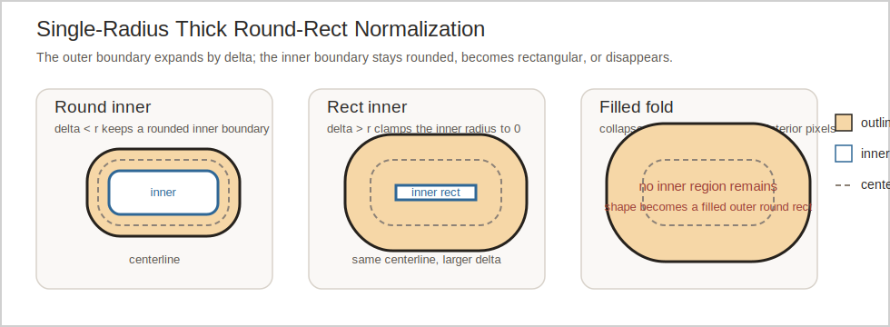

# Smooth Round Rect Inner Boundary Design

Primary references:
[smooth_round_rect_corner_radii_design.md](smooth_round_rect_corner_radii_design.md)
[src/roo_display/shape/smooth.h](../src/roo_display/shape/smooth.h)
[src/roo_display/shape/impl/smooth_round_rect.cpp](../src/roo_display/shape/impl/smooth_round_rect.cpp)
[src/roo_display/shape/impl/smooth_internal.h](../src/roo_display/shape/impl/smooth_internal.h)
[doc/programming_guide.md](../doc/programming_guide.md)

## Status

Implemented. The extracted normalization helper, the filled-fold dispatch, and
the rectangular-inner `SmoothShape::RoundRect` path have all landed, so this
document now describes the shipped single-radius behavior.

## Objective

Correct the geometry semantics of thick smooth round rects once the inward
offset reaches or exceeds the centerline corner radius.

This design lands before the asymmetric-corner work described in
[smooth_round_rect_corner_radii_design.md](smooth_round_rect_corner_radii_design.md).
That later design must reuse the normalization contract defined here instead
of building on the current equal-radius implementation.

## Motivation

The current equal-radius builder keeps producing interior-color pixels in some
very thick shapes after the inward offset has consumed the rounded inner
corners and, in some cases, after the inner region should have disappeared
entirely. That leaves thick-outline behavior inconsistent and gives the later
different-radii work no stable normalization model to extend.

## Background

`SmoothThickRoundRect()` currently normalizes equal-radius shapes by:

- ordering the inputs,
- expanding the outer bounds by `thickness / 2`,
- increasing the outer radius by the same amount,
- clamping the inner radius to `max(0, outer_radius - thickness)`,
- and then deriving the cached helper boxes from corner-center coordinates
  obtained by insetting the outer geometry by `outer_radius`.

Let the centerline bounds be `[cx0, cy0, cx1, cy1]`, the centerline radius be
`r`, the thickness be `t`, and `delta = t / 2`.

With the current code, the corner-center rectangle becomes:

$$
\begin{aligned}
x_{\text{center,left}} &= cx0 + r \\
x_{\text{center,right}} &= cx1 - r \\
y_{\text{center,top}} &= cy0 + r \\
y_{\text{center,bottom}} &= cy1 - r
\end{aligned}
$$

Those center coordinates are independent of thickness. Once `delta > r`, the
inner radius clamps to zero, but the inner helper geometry remains tied to the
frozen center rectangle. The resulting inner span is therefore:

$$
\begin{aligned}
w_{\text{inner,current}} &= (cx1 - cx0) - 2r \\
h_{\text{inner,current}} &= (cy1 - cy0) - 2r
\end{aligned}
$$

instead of the expected inward-offset span:

$$
\begin{aligned}
w_{\text{inner,expected}} &= (cx1 - cx0) - t \\
h_{\text{inner,expected}} &= (cy1 - cy0) - t
\end{aligned}
$$

The current `SmoothShape::RoundRect` payload cannot represent the corrected
geometry after `delta >= r` without additional inner-boundary state. Its
current per-pixel evaluator, rectangle classifier, and stream path all assume
a rounded inner boundary with the same corner-center rectangle as the outer
boundary.

The chosen semantics for this design are:

- the outer boundary is the centerline round rect offset outward by `delta`,
- the inner boundary is the same centerline round rect offset inward by
  `delta`,
- when the inward offset drives the inner radius to zero, the inner boundary
  becomes a sharp-corner rectangle that keeps shrinking by `delta`,
- and when the inward bounds collapse in either axis, the inner region
  disappears and the shape is equivalent to a filled outer round rect in the
  outline color.

The three normalized outcomes are illustrated below. The figure is part of
the geometry contract: if the formulas change, update the illustration to
match the derived coordinates.



## Requirements

- This fix is a prerequisite for implementing the asymmetric-corner work in
  [smooth_round_rect_corner_radii_design.md](smooth_round_rect_corner_radii_design.md).
- The public equal-radius smooth round-rect API remains unchanged.
- Single-radius round-rect normalization is extracted into an internal header
  that tests can include directly.
- Normalization operates on centerline geometry and returns an explicit result
  kind instead of relying on ad hoc post-clamp helper-box construction.
- The normalized result distinguishes three cases: rounded inner boundary,
  rectangular inner boundary, and filled outer round rect.
- When the normalized inner bounds collapse in either axis, the thick shape is
  replaced with a filled outer round rect in the outline color. The interior
  color is ignored because the normalized geometry contains no interior-color
  pixels.
- The common rounded-inner equal-radius case keeps the current optimized
  `SmoothShape::RoundRect` payload, classifier, stream, and draw path.
- The `ROUND_RECT` kind keeps one round-rect helper family per method surface.
  This fix does not add a parallel evaluator or rectangle-classifier entry
  point for the same kind.
- The corrected rectangular-inner case is implemented without slowing down the
  common rounded-inner path.
- `sizeof(SmoothShape)` does not increase.
- The primary test surface is the extracted normalization helper. Raster
  expectation checks are optional secondary coverage, not the main proof of
  geometry.
- The later corner-radii implementation extends the extracted normalization
  model from one radius to four radii.

## Design Overview

Add an internal normalization helper in
[src/roo_display/shape/impl/smooth_internal.h](../src/roo_display/shape/impl/smooth_internal.h)
that works from centerline geometry.

The helper will:

- order the input bounds,
- clamp the centerline radius to half of the centerline minor axis,
- compute `delta = thickness / 2`,
- derive outer bounds and outer radius from the centerline shape,
- derive inner bounds by insetting the centerline bounds by `delta`,
- derive the inner radius as `max(0, centerline_radius - delta)`,
- and classify the normalized geometry as one of three kinds:
  - `kRoundInner`: inner bounds non-empty and inner radius positive,
  - `kRectInner`: inner bounds non-empty and inner radius zero,
  - `kFilled`: inner bounds empty in `x` or `y`.

`SmoothThickRoundRect()` becomes a dispatcher over that normalized result:

- `kRoundInner`: reuse the current optimized `SmoothShape::RoundRect` path,
- `kRectInner`: reuse the same `SmoothShape::RoundRect` kind with an extended
  payload, a rectangular inner-boundary mode, and the same `ROUND_RECT`
  helper family,
- `kFilled`: build the same geometry as a filled outer round rect using the
  outline color.

This document intentionally fixes only the single-radius case. The later
asymmetric-corner design will extend the same normalization contract to four
corner radii.

## Design Details

### Chosen Geometry Semantics

Let the ordered centerline bounds be `[cx0, cy0, cx1, cy1]`, the clamped
centerline radius be `r`, the thickness be `t >= 0`, and `delta = t / 2`.

The normalized outer geometry is:

$$
\begin{aligned}
outer\_x0 &= cx0 - \delta \\
outer\_y0 &= cy0 - \delta \\
outer\_x1 &= cx1 + \delta \\
outer\_y1 &= cy1 + \delta \\
outer\_radius &= r + \delta
\end{aligned}
$$

The normalized inner geometry is:

$$
\begin{aligned}
inner\_x0 &= cx0 + \delta \\
inner\_y0 &= cy0 + \delta \\
inner\_x1 &= cx1 - \delta \\
inner\_y1 &= cy1 - \delta \\
inner\_radius &= \max(0, r - \delta)
\end{aligned}
$$

The normalization result kind is chosen by this rule:

- `kFilled` when `inner_x0 >= inner_x1` or `inner_y0 >= inner_y1`,
- `kRoundInner` when the inner bounds are non-empty and `inner_radius > 0`,
- `kRectInner` otherwise.

Equality folds to `kFilled`. A zero-width or zero-height inner region has no
area and therefore contributes no interior-color pixels.

This is the behavior change. After `delta >= r`, the current implementation
freezes the inner span at `centerline_span - 2 * r`. The chosen design keeps
shrinking the inner span by `t` until it disappears.

### Internal Normalization API

No public API changes are required.

Add a new internal header,
[src/roo_display/shape/impl/smooth_internal.h](../src/roo_display/shape/impl/smooth_internal.h),
with:

```cpp
namespace roo_display {
namespace internal {

enum class NormalizedRoundRectKind {
  kRoundInner = 0,
  kRectInner = 1,
  kFilled = 2,
};

struct NormalizedSingleRadiusRoundRect {
  NormalizedRoundRectKind kind;
  float outer_x0;
  float outer_y0;
  float outer_x1;
  float outer_y1;
  float outer_radius;
  float inner_x0;
  float inner_y0;
  float inner_x1;
  float inner_y1;
  float inner_radius;
};

NormalizedSingleRadiusRoundRect NormalizeSingleRadiusRoundRect(
    float x0, float y0, float x1, float y1, float radius, float thickness);

}  // namespace internal
}  // namespace roo_display
```

The function is declared in the internal header and defined in
[src/roo_display/shape/impl/smooth_round_rect.cpp](../src/roo_display/shape/impl/smooth_round_rect.cpp).
Tests include the header and link against `:roo_display`, so they can assert
normalized kinds and coordinates directly.

Normalization does not perform the existing single-pixel area shortcut.
Tiny-shape and area-based alpha handling stay in the builder after dispatch.

### Builder Dispatch

`SmoothThickRoundRect()` first calls
`internal::NormalizeSingleRadiusRoundRect()`.

For `kRoundInner`, the builder populates the existing
`SmoothShape::RoundRect` payload from the normalized values and keeps the fast
path unchanged.

For `kFilled`, the builder constructs a filled outer round rect with the
normalized outer bounds and normalized outer radius. The fill color is the
outline color. The input `interior_color` is discarded because the normalized
geometry contains no interior-color pixels.

This dispatch uses a private normalized filled builder instead of the public
factory so the code does not immediately renormalize already-normalized outer
geometry.

For `kRectInner`, the builder still constructs `SmoothShape::RoundRect`, but
uses extra stored inner-boundary state and a rectangular-inner mode.

### `SmoothShape::RoundRect` Payload Extension

The existing `SmoothShape::RoundRect` payload is extended rather than adding a
new `SmoothShape` kind.

The extended payload represents:

- an outer round rect with one radius,
- an inner boundary that is either a round rect sharing the outer corner-center
  rectangle or a sharp-corner rectangle with its own bounds,
- an outline color,
- and an interior color.

The payload stores:

- outer corner-center geometry and the outer and inner radii,
- cached outer and inner adjusted squared radii,
- explicit inner rectangle float bounds,
- an inner-boundary mode flag,
- colors,
- and helper boxes that remain valid for direct interior acceptance.

For `kRoundInner`, the explicit inner-rectangle bounds are derived but
redundant; the current shared-center round-inner fast path remains in use.

For `kRectInner`, the explicit inner rectangle bounds become active and the
existing `ROUND_RECT` evaluator, classifier, and any optimized helper logic
branch on the inner-boundary mode.

Estimated size:

- 8 floats for existing outer geometry and caches: 32 bytes,
- 4 floats for explicit inner rectangle bounds: 16 bytes,
- 1 small inner-boundary mode field with normal alignment padding: 4 bytes,
- 2 colors: 8 bytes,
- 3 helper boxes: 24 bytes.

Total: about 84 bytes.

That is still well below the current `SmoothShape::Arc` ceiling, so
`sizeof(SmoothShape)` remains unchanged.

### Rendering Strategy Within `RoundRect`

The corrected rectangular-inner case is implemented inside the existing
`RoundRect` helper family rather than as a separate top-level kind.

The chosen split is:

- `kRoundInner`: keep the existing optimized evaluator, classifier,
  `RoundRectStream`, and draw path,
- `kRectInner`: keep the same round-rect entry points, but make them read an
  explicit inner rectangle instead of inferring the inner boundary from the
  outer corner-center rectangle,
- `kFilled`: dispatch out of the thick builder before a `RoundRect` payload is
  built.

The key observation from the current code is that the existing
`GetSmoothRoundRectPixelColor()` and `DetermineRectColorForRoundRect()`
already separate cheap helper-box acceptance from boundary-distance tests. The
reason they mis-handle `kRectInner` is not that they need a different helper
family; it is that they use the same stored rectangle for both the outer and
inner boundary references.

Today those helpers compute one reference rectangle from `rect.x0`, `rect.y0`,
`rect.x1`, and `rect.y1`, and use it for:

- the outer round-rect distance checks,
- the inner rounded-ring distance checks,
- and, when `ri` reaches zero, the implicit sharp inner rectangle.

That is exactly where the bug enters. After the inward offset exceeds the
centerline radius, the correct inner rectangle keeps shrinking with
`thickness / 2`, but the current helper code still treats the outer
corner-center rectangle as the inner rectangle.

In other words, the current helper logic already has the right sharp-inner-
rectangle anti-aliasing shape once `ri` reaches zero; it is simply evaluating
that shape against the wrong rectangle.

The chosen fix keeps one `ROUND_RECT` helper family and changes only the inner
boundary inputs it reads:

- outer-boundary tests continue to use the stored outer corner-center
  rectangle and outer radius,
- rounded-inner tests continue to use the existing `ri`, `ri_sq_adj`, and
  helper boxes,
- rectangular-inner tests use the explicit inner rectangle bounds,
- and helper-box acceptance remains the first cheap interior fast path in both
  modes.

In concrete terms, the existing code is modified like this:

- `GetSmoothRoundRectPixelColor()` keeps the current rounded-inner math for
  `kRoundInner`.
- For `kRectInner`, the same function still evaluates the outer boundary from
  the outer corner-center rectangle, but it evaluates the inner boundary from
  the explicit inner rectangle bounds. The inner anti-aliasing therefore uses
  the correct shrinking rectangle rather than the frozen one.
- `DetermineRectColorForRoundRect()` keeps the same helper-box containment
  fast path and the same outer-boundary transparency tests. For `kRectInner`,
  its interior and inner-edge proofs switch to the explicit inner rectangle.
  If a rectangle is not cheaply provable from that geometry, the function
  returns `NON_UNIFORM` rather than delegating to a second classifier.
- `ReadRoundRectColors()`, `ReadColorRectOfRoundRect()`,
  `readUniformColorRect()`, `FillSubrectOfRoundRect()`, and `DrawRoundRect()`
  continue to call those same round-rect helpers.

This matches the later corner-radii design direction. The general unequal-
radius case already needs one helper family that can reason about different
outer and inner boundary references. The equal-radius `kRectInner` case is the
same idea in a simpler geometry: one outer round-rect reference and one inner
rectangle reference.

`RoundRectStream` and `drawTo()` remain under the existing `ROUND_RECT` kind
switch as well. The rounded-inner stream stays unchanged. For `kRectInner`,
the first implementation may still keep streaming conservative by falling back
to `Rasterizable` defaults inside the `ROUND_RECT` case. That does not create
another classifier or evaluator family; it only postpones a stream-specific
optimization for the degenerate mode.

This keeps:

- the current fast path intact for the common `kRoundInner` case,
- the corrected rectangular-inner case in the same owning abstraction and the
  same helper family,
- and the later corner-radii work aligned with one round-rect family rather
  than a temporary one-off kind.

The rectangular-inner branch still uses direct guaranteed-interior helper boxes
for fast acceptance.

### Rendering Cost And Footprint Consequences

The chosen design leaves the common equal-radius fast path structurally
unchanged:

- same top-level kind,
- same `RoundRectStream` and draw path for `kRoundInner`,
- same hot-path math once the branch proves the inner boundary is rounded,
- and one additional predictable inner-boundary-mode branch in the shared
  `ROUND_RECT` helpers.

The filled fold improves some classification and draw cases because the
resulting geometry no longer carries a dead inner boundary.

The rectangular-inner branch is expected to be somewhat slower than the
optimized rounded-inner path. The shared evaluator and rectangle classifier now
branch on inner-boundary mode, and the rectangular-inner branch uses explicit
inner-rectangle distance checks instead of the old shared-center ring math.
That extra work is accepted because the case only occurs after thickness
reaches the centerline radius, while the common rounded-inner path keeps the
existing formulas after the mode check.

Code reuse improves relative to a split-helper design: there is still one
`ROUND_RECT` evaluator, one rectangle classifier, and one readback/draw helper
family to maintain. The cost is localized to the mode branch and the extra
stored inner rectangle bounds.

The normalization helper itself is transient and does not change stored render
state.

### Relationship To The Corner-Radii Design

This design lands first and defines the normalization contract that the later
asymmetric-corner design extends.

The later work in
[smooth_round_rect_corner_radii_design.md](smooth_round_rect_corner_radii_design.md)
will generalize:

- one centerline radius to four centerline radii,
- one inner-boundary mode to per-corner inner radii plus the same filled fold
  rule,
- and the extended equal-radius `RoundRect` representation to the permanent
  unequal-corner payload.

The equal-radius fix therefore does not need a separate classifier family to
stay compatible with the later design. It only needs the current
`ROUND_RECT` helpers to stop inferring the inner boundary from the wrong
rectangle.

The corner-radii implementation will not reuse the current fixed-corner-center
equal-radius math.

## Proposed API

Public API: no change.

Internal API added in
[src/roo_display/shape/impl/smooth_internal.h](../src/roo_display/shape/impl/smooth_internal.h):

```cpp
namespace roo_display {
namespace internal {

enum class NormalizedRoundRectKind {
  kRoundInner = 0,
  kRectInner = 1,
  kFilled = 2,
};

struct NormalizedSingleRadiusRoundRect {
  NormalizedRoundRectKind kind;
  float outer_x0;
  float outer_y0;
  float outer_x1;
  float outer_y1;
  float outer_radius;
  float inner_x0;
  float inner_y0;
  float inner_x1;
  float inner_y1;
  float inner_radius;
};

NormalizedSingleRadiusRoundRect NormalizeSingleRadiusRoundRect(
    float x0, float y0, float x1, float y1, float radius, float thickness);

}  // namespace internal
}  // namespace roo_display
```

## Implementation Plan

Authoring reference:
[roo-display-code-authoring](../.github/skills/roo-display-code-authoring/SKILL.md)

### Phase 1: Extract Testable Normalization

Proposed commit message:

`Extract smooth round-rect normalization helper`

Work:

- add [src/roo_display/shape/impl/smooth_internal.h](../src/roo_display/shape/impl/smooth_internal.h),
- add `internal::NormalizedRoundRectKind` and
  `internal::NormalizedSingleRadiusRoundRect`,
- move single-radius ordering, radius clamp, `delta` computation, outer-bound
  derivation, inner-bound derivation, and kind classification into
  `internal::NormalizeSingleRadiusRoundRect()`,
- add direct unit tests for the helper.

Validation:

- `bazel test //:smooth_shapes_test`

### Phase 2: Fold Collapsed Inner Regions To Filled Outer Shapes

Proposed commit message:

`Fold collapsed thick round rects to filled outer round rects`

Work:

- update `SmoothThickRoundRect()` to dispatch from
  `NormalizeSingleRadiusRoundRect()`,
- keep the existing `RoundRect` fast path for `kRoundInner`,
- add a private builder for normalized filled outer round rects,
- route `kFilled` to that builder using the outline color,
- add focused behavior tests for the filled fold.

Validation:

- `bazel test //:smooth_shapes_test`

### Phase 3: Add The Rectangular-Inner Degenerate Path

Proposed commit message:

`Handle thick smooth round rects with rectangular inner bounds`

Work:

- extend `SmoothShape::RoundRect` with explicit inner-rectangle bounds and an
  inner-boundary mode,
- update the existing `ROUND_RECT` helper family so
  `GetSmoothRoundRectPixelColor()` and `DetermineRectColorForRoundRect()`
  branch on inner-boundary mode instead of introducing parallel helpers,
- keep `ReadRoundRectColors()`, `ReadColorRectOfRoundRect()`,
  `readUniformColorRect()`, `FillSubrectOfRoundRect()`, and `DrawRoundRect()`
  on that same helper family,
- route `createStream()` for rectangular-inner payloads through either a
  dedicated branch or conservative `Rasterizable` fallback inside the existing
  `ROUND_RECT` case,
- add focused behavior tests for `delta > radius` with non-empty inner
  bounds,
- update [doc/programming_guide.md](../doc/programming_guide.md) if it
  describes thick smooth round-rect geometry.

Validation:

- `bazel test //:smooth_shapes_test`

## Testing Plan

Primary validation is direct geometry testing of
`internal::NormalizeSingleRadiusRoundRect()`.

Coverage will include:

- ordinary rounded-inner cases,
- the threshold case where `delta == radius`,
- `delta > radius` with non-empty inner bounds, producing `kRectInner`,
- collapse to `kFilled` when the inward bounds disappear,
- and radius clamp against the centerline minor axis.

Behavior-scoped tests will cover:

- equivalence between the `kFilled` fold and the normalized outer filled round
  rect in the outline color,
- and interior preservation for the `kRectInner` case using direct pixel or
  point-read checks rather than full raster templates.

The expected executable validation targets are:

- `bazel test //:smooth_shapes_test`

Raster expectation checks are not required for the primary fix because the
normalization helper gives a tighter and more stable geometry test surface.

## Caveats

The rectangular-inner branch may be slower than the existing rounded-inner fast
path when it uses generic streaming or drawing fallbacks. That tradeoff is
accepted because the branch only appears in a degenerate thick-outline regime,
while the common rounded-inner case keeps its current specialization.

### Rejected Alternatives

#### Keep The Current Frozen-Corner-Center Semantics

Rejected because it preserves interior-color pixels after the inward offset has
already consumed the rounded inner corners and prevents the corner-radii work
from sharing a consistent normalization model.

#### Only Add The Filled Fold And Leave The Rectangular-Inner Case Unchanged

Rejected because it leaves a real geometry discontinuity in the range where
`delta > radius` but the inner bounds are still non-empty. That is the exact
regime the current implementation mis-models.

#### Add A Separate `SmoothShape` Kind For The Rectangular-Inner Case

Rejected because the owning abstraction is still “equal-radius smooth round
rect”. The real issue is missing inner-boundary state in
`SmoothShape::RoundRect`, not a top-level kind mismatch. Reusing `ROUND_RECT`
keeps the fix aligned with the later corner-radii work, where some corners may
retain rounded inner geometry while others collapse.

#### Keep `ROUND_RECT` But Add A Parallel Classifier Or Evaluator Family

Rejected because the helper families in
[src/roo_display/shape/impl/smooth_round_rect.cpp](../src/roo_display/shape/impl/smooth_round_rect.cpp)
are already organized by top-level shape kind. Keeping `ROUND_RECT` while
adding a second evaluator or rectangle-classification entry point for the same
kind would split behavior that is better expressed as one helper family with
an inner-boundary mode branch. The current bug is not missing helper
ownership; it is that the existing helpers infer the inner boundary from the
wrong rectangle.

#### Test Only Through Raster Expectation Images

Rejected because the geometry bug is a normalization bug first. Direct helper
tests provide exact assertions on kinds, bounds, and radii and avoid coupling
the proof of correctness to later rasterization optimizations.

#### Keep Normalization Private To `smooth.cpp`

Rejected because that forces tests to infer geometry from raster output and
gives the later corner-radii work no reusable normalization contract.

## Future Work

- Extend `NormalizeSingleRadiusRoundRect()` to `RoundRectRadii` in the later
  [smooth_round_rect_corner_radii_design.md](smooth_round_rect_corner_radii_design.md)
  asymmetric-corner design.
- Extend the equal-radius inner-boundary mode and explicit inner-boundary state
  to the later unequal-corner payload and its dedicated readback, stream, and
  draw helpers.